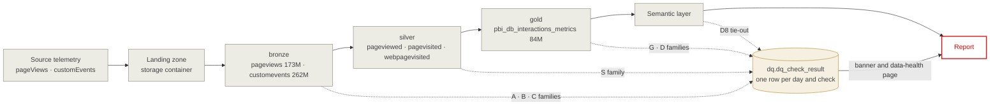
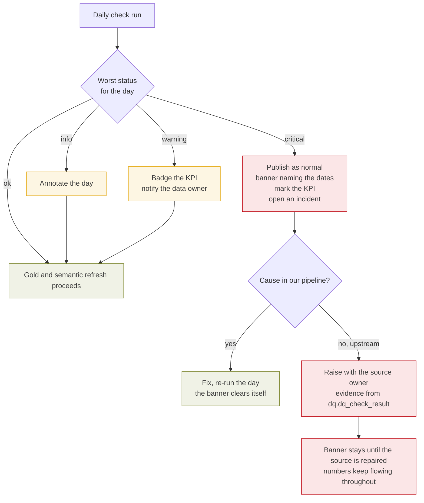

# Business Requirements Document — Telemetry Data Integrity Monitoring

**Project:** Data Integrity Monitoring for Intranet Communication Analytics
**Version:** 0.2 — Draft
**Status:** In Review
**Date:** 2026-09-11
**Audience:** Business Analysts, Data Engineers, Product Owner, Reporting Stakeholders

---

## 1. Executive Summary

Between 7 and 8 April 2026 the browser identifier in the intranet telemetry stopped
persisting. Every page view began arriving with a fresh browser identity and a
fresh session, so a view became a visit. Page views and unique visitors stayed
correct, the dashboards stayed plausible, and the defect was found by people
several weeks later rather than by the pipeline.

Measured after the fact, a single ratio would have raised an alarm on day one:
page views per session fell from about 2.2 to 1.06 while the number of distinct
employees did not move at all. Nothing in the platform was watching that ratio.

This document specifies the monitoring that closes the gap. It defines 37 checks
across four question families and three medallion layers, the thresholds
calibrated on real pre-incident data, the severity model that decides whether a
data is labelled, and the delivery plan. The implementation exists as a reviewed
SQL draft; this BRD is the specification it is measured against.

**The ask:** approve the requirements in §6, the operating model in §8, and the
phasing in §11, and resolve the open points in §13.

---

## 2. Business Goals

| # | Goal | Metric |
|---|---|---|
| G1 | An identity-class defect is detected on the day it starts, not weeks later | Time from onset to alert < 24 h |
| G2 | No number is read without its known defects being visible at the same time | 100 % of affected days visibly labelled in the report |
| G3 | Stakeholders can see the health of the data behind a number | Data-health page live in the report |
| G4 | Every layer of the pipeline carries its own integrity, not inherited trust | ≥ 3 checks owned by each of bronze, silver, gold |
| G5 | Thresholds are measured, not assumed | 100 % of identity thresholds calibrated on pre-incident data |
| G6 | An incident produces evidence a vendor can act on | Version, timing and scope of a change reconstructable from stored results |

---

## 3. Background — the April incident

### 3.1 What happened

| Day | Page views per session | Browser ids per person | Distinct people | Distinct browser ids |
|---|---|---|---|---|
| Tue 31 Mar | 2.272 | 1.13 | 56,081 | 63,234 |
| Wed 1 Apr | 2.018 | 1.12 | 56,677 | 63,426 |
| Mon 6 Apr | 1.755 | 1.15 | 34,041 | 38,989 |
| **Tue 7 Apr** | **1.665** | **1.66** | 59,684 | **98,861** |
| **Wed 8 Apr** | **1.059** | **3.98** | 54,849 | **218,078** |
| Thu 23 Apr | 1.058 | 3.84 | 56,559 | 217,020 |

Source: `dq_checks_draft.sql` Block 0c, executed 2026-09-11 against
`sharepoint_bronze.pageviews`.

### 3.2 What the shape tells us

- **Onset 7 April, completion 8 April.** The browser identities move first, a day
  before the session ratio collapses.
- **A two-day ramp followed by a flat plateau** reads as a staged rollout rather
  than a single configuration switch.
- **The population never moved.** Distinct employees stayed within a normal band
  across the whole month, and so did page views. Only the identifiers changed.

### 3.3 What was and was not affected

| Metric | Basis | Affected |
|---|---|---|
| Page views | Row count | No |
| **Unique visitors** | Employee number and e-mail, matched to HR, resolved to a contact id | **No** |
| Visits | `session_Id` cookie | **Yes, inflated** |
| Pages per visit, time on page, bounce rate | Session grouping | **Yes, collapsed** |

Unique visitors never rested on the browser cookie, which is why the headline
audience figures survived. This distinction is the reason the defect stayed
invisible for so long: the numbers most people look at were right.

### 3.4 Why it went unnoticed

Absolute volumes moved with the business calendar and looked normal. No ratio
between fields was monitored, no layer reconciled against the next, and no check
result was stored anywhere a person or an alert could read it.

---

## 4. Scope

### 4.1 In scope

- The `pageViews` and `customEvents` telemetry from the source platform, through
  bronze, silver and gold, to the semantic layer consumed by the report.
- Completeness, identity, schema and plausibility checks on that path.
- Storage of every check result, alerting, and the labelling that makes a
  defective day visible at the point of consumption.
- A data-health surface in the report.

### 4.2 Out of scope (this phase)

- The email and event channels. The same pattern applies and is a later phase.
- Root-cause remediation of the April incident itself, which sits with the vendor.
- Changing the reported definition of a visit. See OP-01.
- Automated correction or back-filling of affected history.

---

## 5. Architecture

### 5.1 Where each check sits

### 5.2 The four questions

Every check answers exactly one. A check that answers none is not a check.

| Family | Question | Reads | Catches |
|---|---|---|---|
| **A** Completeness | Did everything arrive? | bronze, all layers | Stalled exports, partial days, silent sampling, lost rows |
| **B** Identity | Do we still recognise people? | bronze | The April class of defect |
| **C** Schema | Does the data still look like the data? | bronze, staging | Releases and configuration changes, before they reach a number |
| **D** Plausibility | Do the numbers make sense? | gold, semantic | Anything the first three missed, seen from outside |
| **S / G** Layer-local | Did this layer do its own job? | silver, gold | Person resolution, grain, aggregation |

### 5.3 Integrity per layer

A failure inside one layer is invisible to the others, so each layer owns checks
and each hop is reconciled.

| Layer | Owns | Checks | Tie-out to the next layer |
|---|---|---|---|
| Bronze | Arrival, schema, formats, raw identity | A1–A7, B1–B8, C1–C8 | A6, row counts across all three |
| Silver | Person resolution, key completeness | S1–S3 | S1, bronze employees vs silver contacts |
| Gold | Aggregate correctness, KPI plausibility | G1–G3, D1–D8 | G3, silver rows vs gold views |

---

## 6. Functional requirements

### 6.1 Detection — `FR-DET`

| # | Requirement | Priority |
|---|---|---|
| FR-DET-01 | Compute every check once per day, per check, on the previous day's data | Must |
| FR-DET-02 | Detect an identity-class defect within one day of onset | Must |
| FR-DET-03 | Evaluate ratios between fields, not only absolute volumes | Must |
| FR-DET-04 | Compare against a trailing 8-week, same-weekday baseline using median and MAD | Must |
| FR-DET-05 | Evaluate a persistent shift (7-day mean vs prior 28-day mean) alongside point outliers | Must |
| FR-DET-06 | Suppress alerting until at least four same-weekday observations exist | Must |
| FR-DET-07 | Exclude public holidays from the baseline via a calendar table | Must — see §10.3 |
| FR-DET-08 | Compute identity ratios on a **daily** grain, never pooled over a window | Must — see §10.2 |

### 6.2 Recording — `FR-REC`

| # | Requirement | Priority |
|---|---|---|
| FR-REC-01 | Persist one row per day and check in `dq.dq_check_result` | Must |
| FR-REC-02 | Record metric value, baseline, bounds, status and a human-readable note | Must |
| FR-REC-03 | Re-running a day must not duplicate results (idempotent by day and check) | Must |
| FR-REC-04 | Retain results for at least 24 months, so an incident is reconstructable | Must |
| FR-REC-05 | No check result may exist only in a job log | Must |

### 6.3 Response — `FR-RSP`

| # | Requirement | Priority |
|---|---|---|
| FR-RSP-01 | Three severities: Info, Warning, Critical, per §8.1 | Must |
| FR-RSP-02 | **Data is never withheld.** No check result may gate, delay, drop or filter a refresh, a row or a date. A failing check labels data; it never removes it | Must |
| FR-RSP-03 | A critical result shows a banner naming the affected date range **and the affected figures by name**, and marks those figures | Must |
| FR-RSP-04 | A warning notifies the data owner the same morning and badges the affected KPI | Must |
| FR-RSP-05 | A **Health Overview** gives the technical team every check, layer and day for the last 90 days, with drill-down to the failing metric | **Must** — the compensating control for FR-RSP-02 |
| FR-RSP-08 | Each check declares which reported figures it casts doubt on. Labelling is scoped to those figures only | Must |
| FR-RSP-09 | A figure no failing check points at is never labelled. Correct numbers stay visibly correct | Must |
| FR-RSP-10 | The Health Overview is readable without knowledge of the checks: organised by reported figure, every check named in plain language, no check identifier above the fold | Must |
| FR-RSP-11 | A finding that has held the same level for weeks is shown as an ongoing condition, distinct from one that moved this week | Must |
| FR-RSP-06 | An info-level event annotates the day without notifying anyone | Should |
| FR-RSP-07 | Row-level rules warn and keep. No expectation may drop or reject a row | Must |

### 6.4 Calibration — `FR-CAL`

| # | Requirement | Priority |
|---|---|---|
| FR-CAL-01 | Identity thresholds derive from measured pre-incident data, not assumption | Must |
| FR-CAL-02 | Absolute bounds must sit below the healthy **weekend**, so weekends do not alert | Must |
| FR-CAL-03 | Thresholds must not be retuned to a known-broken state | Must |
| FR-CAL-04 | Review thresholds after four weeks of operation | Should |

### 6.5 Non-functional — `NFR`

| # | Requirement | Priority |
|---|---|---|
| NFR-01 | The daily run materialises one bounded slice; no check scans the full 173M-row table | Must |
| NFR-02 | Range predicates must remain file-skippable; no predicate wrapped in `CAST` | Must |
| NFR-03 | Compatible with the Hive Metastore; `information_schema` is not available | Must |
| NFR-04 | Read-only against source tables; writes confined to the `dq` schema | Must |
| NFR-07 | A read-only edition must exist that runs anywhere without creating a single persistent object | Must |
| NFR-08 | No object is created in PROD before the same change has run in Dev and pre-prod | Must |
| NFR-05 | Total daily runtime under 15 minutes | Should |
| NFR-06 | No employee number, e-mail or page-level personal data in an alert payload | Must |

---

## 7. Check catalogue

The full catalogue with formulas, fields, layers, thresholds and severities is
maintained in [`data-integrity-checks.md`](data-integrity-checks.md). A worked
example for each check, healthy beside broken, is in
[`integrity-checks-by-example.html`](integrity-checks-by-example.html).

Summary by family:

| Family | Checks | Would have caught April |
|---|---|---|
| A — Completeness | A1 … A7 | No, volumes looked normal |
| B — Identity | B1 … B8 | **Yes, day one** |
| C — Schema | C1 … C8 | Leading indicator only |
| D — Plausibility | D1 … D8 | Yes, via the divergence pattern |
| S — Silver | S1 … S3 | Guards the metric that stayed correct |
| G — Gold | G1 … G3 | Independent failure modes |

### 7.1 The executive watchlist

Ten signals, the subset a non-specialist should be able to read.

| # | Signal | Healthy | Broken looks like | Caught April |
|---|---|---|---|---|
| 1 | Page views per visit | 1.94–2.35 weekday | 1.06 | Day 1 |
| 2 | Browser identities per employee | 1.06–1.15 | 3.7–4.15 | Day 1 |
| 3 | Recurring browser identities | high, stable | near 0 % | Day 1 |
| 4 | Visits per browser identity, weekly | above 1 | 1.0 | Day 1–2 |
| 5 | Cookie visits vs person visits | about 1 | inflates | Day 1 |
| 6 | Gold vs a fresh recount | about 1 | visits diverge, people agree | Day 1 |
| 7 | Tracking software version set | unchanged | any change | Leading indicator |
| 8 | Arrival volume | within ±25 % of same weekday | outside | No |
| 9 | Sampling factor | exactly 1.00 | above 1.00 | No |
| 10 | Layer tie-out | exact | any gap | No |

---

## 8. Operating model

### 8.0 Why nothing is ever held back

This is a deliberate architectural position, not an omission. Three reasons.

**A defect is partial; a hold is total.** April is the proof. Page views and
unique visitors were correct throughout, because unique visitors rest on the
contact id rather than the browser cookie. Visits and the engagement metrics
were wrong. A hold would have removed all of it, including the two figures most
people open the report to see. Withholding correct numbers to protect someone
from an incorrect one is a poor trade, and it is one the reader never gets to
make for themselves.

**We have many downstream dependencies.** Stopping a load does not pause one
report, it stalls a chain. Every consumer of the affected layer inherits the
outage, including those whose numbers were never in doubt.

**Stale is worse than flagged, because stale is silent.** A held refresh leaves
yesterday's figures on the screen with nothing to indicate they are old. A
published figure carrying a visible label tells the reader exactly what is
wrong and lets them decide whether it affects their question.

The consequence is that the labelling has to be good enough to replace the gate.
Two surfaces do that, for two different audiences, and both are mandatory:

| Surface | Audience | Purpose |
|---|---|---|
| **Health Overview** | The technical team | Operational monitoring. Every check, every layer, every day, with drill-down. This is where a defect is found and worked. |
| **Banner and KPI badge** | Report consumers | Scoped labelling. Names only the figures a failing check actually casts doubt on, so correct numbers are not discredited alongside. |

### 8.1 Severity and response

**Publishing always continues.** Severity changes how loudly a defect is
announced, never whether the data appears. Withholding a number is itself a
failure mode: a stale report is silent about its staleness, while a published
number carrying a visible warning lets the reader judge for themselves. The
labelling in the right-hand column is therefore mandatory, not decorative. It is
what earns the right to keep publishing.

| Severity | Publishing | Report | People |
|---|---|---|---|
| Info | Continues | Day annotated in the result table | Nobody |
| Warning | Continues | Badge on the data-health page and on the affected KPI | Data owner, same morning |
| Critical | **Continues** | Banner naming the affected dates on every page, plus the KPI marked | Data owner and product owner, incident opened |

Renamed from *Critical* on 2026-09-11. Under this policy the level never blocked a
refresh, and a name implying otherwise would mislead whoever maintains it.

### 8.1a What scoped labelling looks like

Applied to April, the identity family fires and the banner reads:

> Visits, pages per visit, average time on page and bounce rate are under review
> from 7 April. Page views and unique visitors are unaffected.

Not *"data under review"*. The second sentence is the one that matters: it keeps
two correct figures usable, which is the entire point of not holding the load.

### 8.2 Escalation path

### 8.3 Roles

| Role | Responsibility |
|---|---|
| Data owner | First responder on a warning; triages a critical result |
| Product owner | Owns the banner wording and the incident |
| Data engineer | Maintains the checks, re-runs an affected day after a fix |
| Report consumer | Reads the data-health page; no action required |

---

## 9. Result data model

One row per day and check. Alerts, the data-health page and any incident
reconstruction all read this single table.

| Column | Type | Purpose |
|---|---|---|
| `check_date` | DATE | The day being judged, not the day of the run |
| `check_id` | STRING | A1 … D8, S1 … G3 |
| `family` | STRING | completeness · identity · schema · plausibility |
| `layer` | STRING | staging · bronze · silver · gold · semantic |
| `metric_value` | DOUBLE | What was measured |
| `baseline` | DOUBLE | What was expected |
| `lower_bound` / `upper_bound` | DOUBLE | The corridor applied |
| `status` | STRING | ok · info · warning · critical |
| `note` | STRING | Human-readable, carries the evidence |
| `computed_at` | TIMESTAMP | When the judgement was made |

---

## 10. Calibration

### 10.1 Measured baselines

From Block 0c, 25 March to 23 April 2026, daily grain.

| Metric | Healthy weekday | Healthy weekend | Broken, from 8 April |
|---|---|---|---|
| Page views per session | 1.94–2.35 | 1.59–1.71 | 1.05–1.08 |
| Browser identities per person | 1.11–1.15 | 1.06–1.08 | 3.70–4.15 |
| Single-view session share | 0.54–0.65 | 0.73–0.76 | 0.93–0.95 |
| Views carrying an employee number | 1.00 | 1.00 | 1.00 |

Because these describe healthy data, checks B1, B4 and B5 flag today by design
and will keep flagging until the source is repaired. Retuning them to the current
state would define the incident away and is explicitly forbidden by FR-CAL-03.

### 10.2 Daily, never pooled

A fortnight-pooled measurement reported 20.0 browser identities per person for
the broken state. The same state measured daily reads about 3.9. Pooling inflates
any per-person identity count, because browser identities do not recur across
days while people do. The checks run daily, so the daily figures govern.

### 10.3 Holidays

Good Friday on 3 April drew 29,845 page views against roughly 220,000 on a normal
Friday, and Easter Monday 108,580 against roughly 316,000. Without a holiday
calendar, check A1 raises a critical result on both days every year. A calendar table is
a prerequisite for phase 1, not an enhancement.

---

## 10.4 Environments and the read-only edition

Nothing is created in PROD before it has been through Dev and pre-prod. Until
then the same checks run in a read-only edition that persists nothing, so the
current state of PROD can still be observed without changing it.

| Edition | File | Creates | Where |
|---|---|---|---|
| Read-only | [`../dq_checks_prod_readonly.sql`](../dq_checks_prod_readonly.sql) | Temporary views only, session-scoped, plus one cached slice released at the end | PROD, today |
| Persistent | [`../dq_checks_draft.sql`](../dq_checks_draft.sql) | A `dq` schema with result and definition tables | Dev, then pre-prod, then PROD |

The read-only edition issues no `CREATE SCHEMA`, `CREATE TABLE`, `INSERT`,
`MERGE`, `DELETE` or `UPDATE`. A temporary view is a query definition held in one
session; it is invisible to others and disappears on detach. `CACHE TABLE`
materialises into cluster memory and spilled local disk, never into the
lakehouse, and the final cell releases it.

**What the read-only edition cannot do**, and why the persistent one is still the
target: no history, so no trending and no baseline drift detection over time; no
alerting, since there is no table for an alert to watch; no hands-off Health
Overview, because someone has to run the notebook; and no record of what was
judged when, which is exactly the evidence an incident needs afterwards. It
answers "is the data sound right now", not "when did this start".

## 11. Delivery plan

| Phase | Weeks | Content | Outcome |
|---|---|---|---|
| 0 | — | Blocks 0, 0b, 0c: probe columns, calibrate, date the incident | **Complete, 2026-09-11** |
| 0b | — | Read-only edition runnable against PROD, persisting nothing | **Available now** — observe PROD without changing it |
| 1 | 1–2 | B1, B3, B4, A1, A2, A4, A6, C3; result table; one alert; holiday calendar. **Built in Dev, promoted through pre-prod** | The eight checks that catch an April-class defect on day one |
| 2 | 3–4 | B2, B5, B7, C1, C2, C5, D1, D5, D8, S1–S3 | Full identity family, silver family, row-level expectations, report tie-out, data-health page |
| 3 | 5–6 | Remaining A, C, D checks; G1–G3; banner driven by `dq.v_affected_dates`; data-health page | Operating model complete |

---

## 12. Acceptance criteria

| # | Criterion |
|---|---|
| AC-01 | Replaying 1 March to 30 April 2026 raises a critical result on 7 or 8 April and none on 1–6 April |
| AC-02 | No check raises a warning on a healthy weekend in the replay |
| AC-03 | Good Friday and Easter Monday raise no volume critical result |
| AC-04 | A critical result publishes as normal **and** the affected date is visibly labelled; no code path exists that can withhold a date |
| AC-05 | Re-running a day produces one result row per check, not two |
| AC-06 | The data-health page renders the last 90 days from `dq.dq_check_result` |
| AC-07 | Full daily runtime stays under 15 minutes on the production cluster |

---

## 13. Open points

- **OP-01** (decision) Reported definition of a visit: the cookie `session_Id`, the
  company standard since 2026-07-13, or a person-based visit from the employee
  number plus a 30-minute inactivity rule. Changing it restates history. Unique
  visitors are unaffected either way, as they already rest on the contact id.
- **OP-02** (owner) Who receives a warning, and who owns the banner wording on a
  critical result.
- **OP-03** (dependency) Source of the public-holiday calendar, per §10.3.
- **OP-04** (data) The relationship between bronze `pageId`, an INT, and the page
  inventory key `pageUUID`, a GUID string. Check C6 currently joins on the URL as
  a stand-in.
- **OP-05** (data) Bronze carries two ingestion stamps, `gmdp_timestamp` and
  `ingestiontime`. One comparison run should establish whether they differ.
- **OP-06** (scope) Whether `customEvents` receives the same identity family in
  phase 2 or phase 3.
- **OP-07** (investigation) The version `javascript:3.3.6` disappears between 16
  and 24 March, two to three weeks before the identity break. Not the same event,
  possibly the same change wave. Narrowing that window is open.
- **OP-08** (investigation) Bronze carries `user_AuthenticatedId` and
  `user_AccountId`, neither yet analysed. If either remained stable across 7 April
  it is both a diagnostic and a candidate replacement key.
- **OP-09** (governance) Retention of `dq.dq_check_result` beyond 24 months, and
  whether check results are themselves subject to the platform's retention policy.

---

## 14. References

| Document | Purpose |
|---|---|
| [`data-integrity-checks.md`](data-integrity-checks.md) | The full check catalogue: formulas, fields, thresholds, measured results |
| [`dq_blocks_engineering_notes.md`](dq_blocks_engineering_notes.md) | Block-by-block engineering companion to the SQL |
| [`../dq_checks_draft.sql`](../dq_checks_draft.sql) | The implementation draft |
| [`integrity-checks-by-example.html`](integrity-checks-by-example.html) | Every check on a worked example, for non-specialists |
| [`data-integrity-checks.html`](data-integrity-checks.html) | Executive one-pager |
| `docs/knowledge_base.md` | Table inventory and medallion structure. Lives on the main branch, not on this one |
