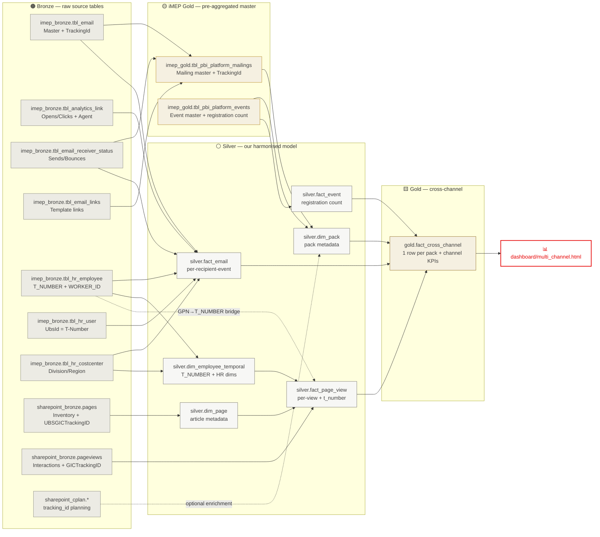
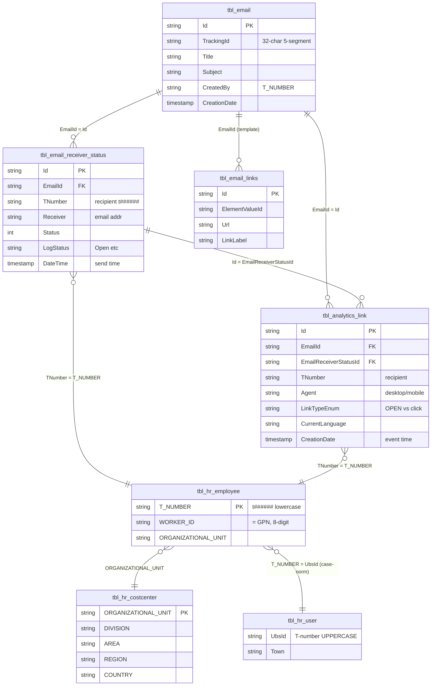
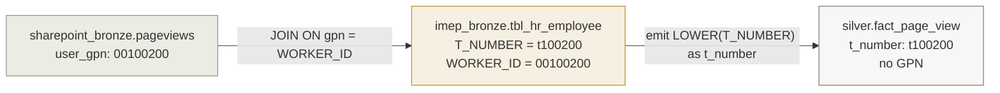
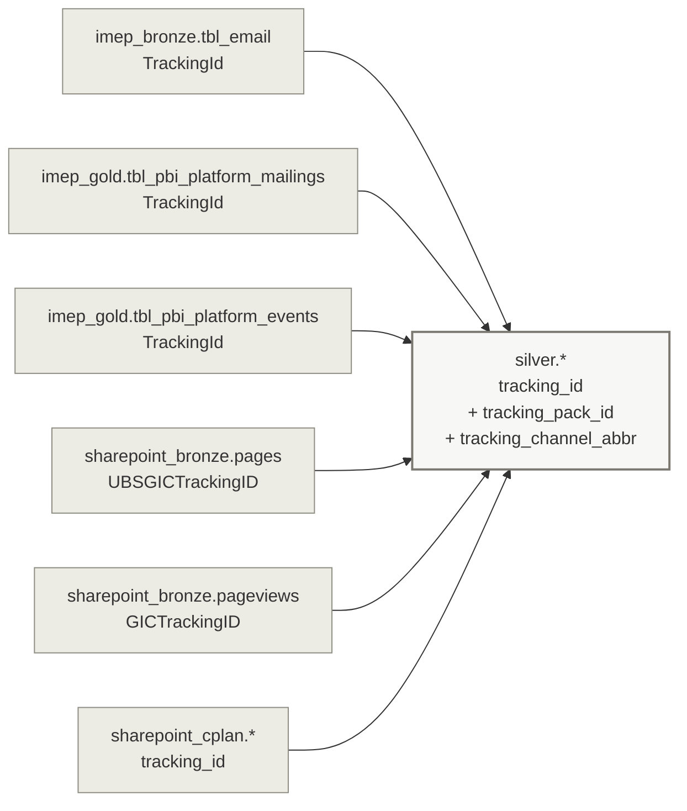
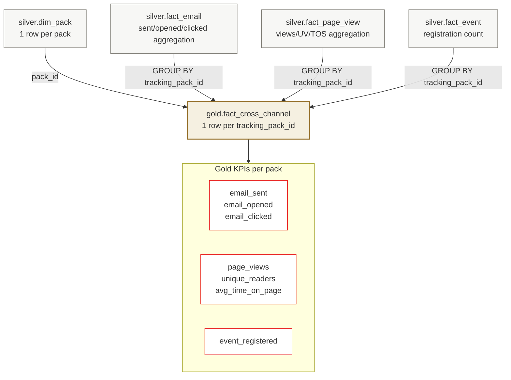
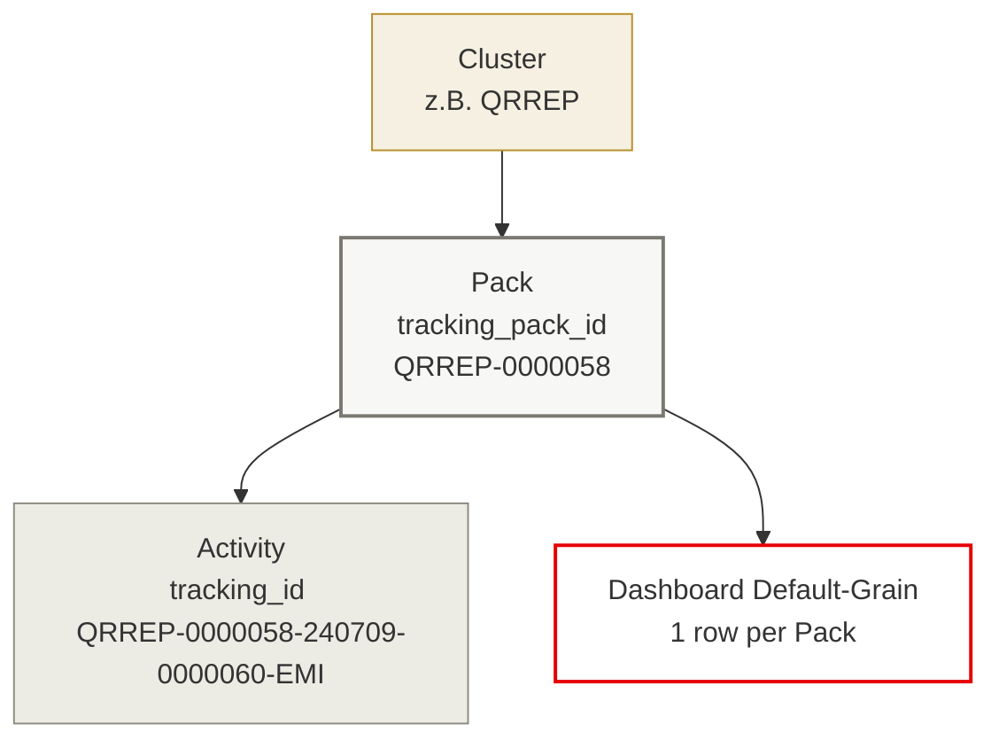
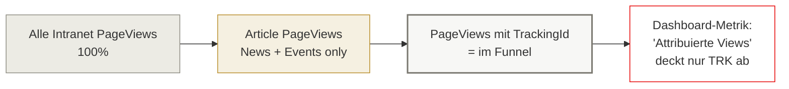

# Architektur — Cross-Channel Communication Analytics

Visualisierung der Datenflüsse und Join-Keys zwischen Bronze, Silver, Gold und Dashboard.
Begleitet [BRD_cross_channel_analytics.md](BRD_cross_channel_analytics.md) und
[genie_questions_imep.md](genie_questions_imep.md).

---

## 1. End-to-End Data Flow (Layers)



---

## 2. iMEP — Bronze-Join-Patterns (Pattern 2 aus Genie-Code)

So baut sich `silver.fact_email`: eine Row pro Empfänger-Interaktion, angereichert mit HR und Mailing-Master.



**Zentrale Join-Kette für `silver.fact_email`** (vereinfacht):

```
FROM       tbl_analytics_link a
LEFT JOIN  tbl_email_receiver_status c  ON a.EmailReceiverStatusId = c.Id
LEFT JOIN  tbl_email b                  ON a.EmailId               = b.Id
LEFT JOIN  tbl_hr_employee hr           ON a.TNumber               = hr.T_NUMBER
LEFT JOIN  tbl_hr_costcenter cc         ON hr.ORGANIZATIONAL_UNIT  = cc.ORGANIZATIONAL_UNIT
LEFT JOIN  tbl_hr_user u                ON LOWER(hr.T_NUMBER)      = LOWER(u.UbsId)
WHERE      a.IsActive = 1
```

---

## 3. Employee-Identity-Bridge (GPN ↔ TNumber)

Das einzige Stelle, an der GPN im Modell lebt: beim Enrichment der PageView-Telemetrie. Danach nur noch TNumber.



| Identifier | Ort | Format |
|---|---|---|
| `user_gpn` in pageviews | `sharepoint_bronze.pageviews` | `00100200` (8-digit) |
| `WORKER_ID` (= GPN) | `imep_bronze.tbl_hr_employee` | `00100200` |
| `T_NUMBER` | `imep_bronze.tbl_hr_employee` | `t100200` (lowercase) |
| `TNumber` in iMEP | `tbl_email_receiver_status`, `tbl_analytics_link` | `t100200` |
| `UbsId` | `imep_bronze.tbl_hr_user` | `T100200` (UPPERCASE) |

→ Nach Silver-Build: einheitlich `t_number` (lowercase), überall. GPN gelöscht.

---

## 4. Cross-Channel-Join über TrackingId

TrackingId ist der einzige kanalübergreifende Key — 32 Zeichen, 5 Segmente:

```
QRREP-0000058-240709-0000060-EMI
  │       │       │       │     └── channel:  EMI / INT / EVT / BAN
  │       │       │       └──────── activity sequence
  │       │       └──────────────── YYMMDD
  │       └──────────────────────── pack number
  └──────────────────────────────── cluster
  └───────┬───────┘
   tracking_pack_id  ← Dashboard-Grain
```

**Namens-Varianten pro System** (Silver harmonisiert sie zu `tracking_id`):



---

## 5. Gold Cross-Channel Fact — der Funnel pro Pack



**Funnel auf Pack-Ebene:**

```
Sent (100%) ─► Opened (~45%) ─► Clicked (~8%) ─► Page View (~6%) ─► Event Registered (~1.5%)
                                                      │
                                              nur Article-Pages
                                        (UBSGICTrackingID populated)
```

---

## 6. Dashboard-Grain-Hierarchie



Default-View zeigt eine Row pro Pack (`tracking_pack_id`). Drill-Down zur Activity-Ebene (`tracking_id`) optional. Roll-up zum Cluster für Programm-Reports.

---

## 7. Coverage Disclaimer (Q15-Findings)



Q15/Q15b quantifizieren den Anteil TRK pro Monat → Default-Zeitraum und Coverage-Note im Dashboard.
