```mermaid
flowchart LR
    A["Email sent<br/>(tbl_email_receiver_status)"] --> B["Email opened<br/>(tbl_analytics_link)"]
    B --> C["Email link clicked<br/>(tbl_analytics_link)"]
    C -.TrackingId bridge.-> D["Page view<br/>(pbi_db_interactions_metrics)"]
    D --> E["Time on page<br/>(durationsum)"]
    E --> F["Event registration<br/>(imep_silver.eventregistration)"]

    style C stroke:#E60000,stroke-width:3px
    style D stroke:#E60000,stroke-width:3px

    classDef email fill:#ECEBE4,stroke:#8E8D83;
    classDef sp    fill:#F5F0E1,stroke:#B98E2C;
    classDef event fill:#F7F7F5,stroke:#7A7870;
    class A,B,C email;
    class D,E sp;
    class F event;
```

# ER Diagram — Cross-Channel Bridge

> The **only bridge** between iMEP (Email) and SharePoint (Intranet). Runs via **TrackingId ↔ UBSGICTrackingID** at the dimensional level (`tbl_email` ↔ `pages`), **never** through engagement facts directly. Plus the Employee bridge via `tbl_hr_employee.WORKER_ID`.

---

## The entire cross-channel architecture in one picture


---

## The two bridges

### Bridge 1: TrackingID (campaign-level)

**Where?**: `tbl_email.TrackingId` ↔ `sharepoint_bronze.pages.UBSGICTrackingID`

**Grain**: **Pack (SEG1-2 = Cluster + Pack number)**. The pack bundles all activities of a campaign — email, intranet page, newsletter, etc. — regardless of their individual dates and channel codes.

**Match logic**:
```sql
-- Match on pack level (SEG1-2); ignore everything after (date/activity/channel)
ON  array_join(slice(split(UPPER(email.TrackingId),         '-'), 1, 2), '-')
  = array_join(slice(split(UPPER(pages.UBSGICTrackingID),  '-'), 1, 2), '-')
```

**Why not match more narrowly?** Email and intranet page of the same pack typically run on different days (SEG3), with different activity sequencing (SEG4), and on a different channel (SEG5). Only pack-level finds the activities that belong together semantically.

**Coverage reality**:
- iMEP side: 986/73,930 mailings (1.3%) have a TrackingId
- SP side: 1,949/48,419 pages (4%) have a TrackingID
- **Realistic pack intersection**: 54 packs — the dashboard universe

### Bridge 2: Employee identity (person-level)

**Where?**: `tbl_hr_employee.WORKER_ID` (iMEP) ↔ `sharepoint_bronze.pageviews.user_gpn` (SharePoint)

**Both are GPN** in `00100200` format (8-digit). `WORKER_ID` in HR, `user_gpn` in SP Bronze.

**Alternative** (not yet validated): `sharepoint_gold.pbi_db_employeecontact` carries `T_NUMBER` directly — could be a shorter path than the GPN detour.

---

## Why **no** direct engagement join?

A common misconception: "Can I join `tbl_analytics_link.TNumber` directly against something in SharePoint to see whether the same person opened the email AND read the page?"

**Answer**: not directly, because:

1. **SharePoint carries no TNumber** — only `user_gpn` or `viewingcontactid`
2. **Engagement tables carry no TrackingID** in either domain

The correct path:

```
tbl_analytics_link.TNumber
        │ JOIN tbl_hr_employee.T_NUMBER
        ▼
tbl_hr_employee.WORKER_ID  (= GPN)
        │ JOIN sharepoint_bronze.pageviews.user_gpn
        ▼
pageviews.pageId
        │ JOIN sharepoint_bronze.pages.pageUUID
        ▼
pages.UBSGICTrackingID  (if present)
        │ SEG1-2 (pack) compare
        ▼
tbl_email.TrackingId
```

This is a **5-hop chain**. In practice you do not run it row-by-row but aggregated at pack level (see [cross_channel_via_tracking_id.md](../joins/cross_channel_via_tracking_id.md)).

---

## The canonical cross-channel funnel



**The transition marked in red** is the only cross-channel moment — and it is **dimensional** (via TrackingID on `pages`), not factual.

---

## Typical funnel numbers

```
1,000 mailings sent      (from the 1.3%-tracked universe, from 2025)
  │
  │ ~22% open rate
  ▼
  220 opens
  │
  │ ~1.8% click rate
  ▼
   18 clicks
  │ ↓ cross-channel break (only 4% attributable on the SP side)
  ▼
    X page views  (highly variable, depends on site coverage)
```

---

## References

- [join_strategy_contract.md](../joins/join_strategy_contract.md) — rules 1 + 5
- [cross_channel_via_tracking_id.md](../joins/cross_channel_via_tracking_id.md) — full SQL recipe
- [hr_enrichment.md](../joins/hr_enrichment.md) — GPN bridge
- Memory: `imep_join_graph_q27_findings.md`, `tracking_id_format_q23.md`, `tracking_id_volume_q24.md`

---

## Sources

Genie sessions backing the statements on this page: [Q21](../sources.md#q21), [Q22](../sources.md#q22), [Q24](../sources.md#q24), [Q25](../sources.md#q25), [Q27](../sources.md#q27). See [sources.md](../sources.md) for the full index.
