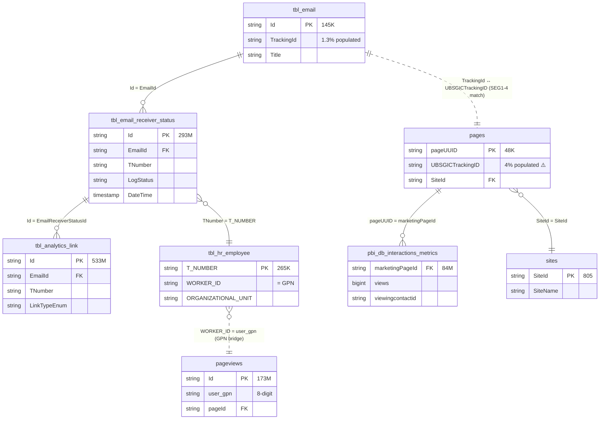

# ER-Diagramm — Cross-Channel Bridge

> Die **einzige Brücke** zwischen iMEP (Email) und SharePoint (Intranet). Läuft über **TrackingId ↔ UBSGICTrackingID** auf der Dimensions-Ebene (`tbl_email` ↔ `pages`), **niemals** über Engagement-Facts direkt. Plus die Employee-Bridge über `tbl_hr_employee.WORKER_ID`.

---

## Die gesamte Cross-Channel-Architektur in einem Bild



---

## Die zwei Bridges

### Bridge 1: TrackingID (Campaign-Level)

**Wo?**: `tbl_email.TrackingId` ↔ `sharepoint_bronze.pages.UBSGICTrackingID`

**Grain**: Pack (Cluster + Pack-Number), optional Activity (SEG1-3).

**Match-Logik**:
```sql
-- SEG1-4 matchen, SEG5 (System-Ownership) ignorieren
ON  array_join(slice(split(UPPER(email.TrackingId),         '-'), 1, 4), '-')
  = array_join(slice(split(UPPER(pages.UBSGICTrackingID),  '-'), 1, 4), '-')
```

**Coverage-Reality**:
- iMEP-Seite: 986/73,930 Mailings (1.3%) haben TrackingId
- SP-Seite: 1,949/48,419 Pages (4%) haben TrackingID
- **Realistische Pack-Schnittmenge**: 54 Packs (Q24) — der Dashboard-Universum

### Bridge 2: Employee-Identity (Person-Level)

**Wo?**: `tbl_hr_employee.WORKER_ID` (iMEP) ↔ `sharepoint_bronze.pageviews.user_gpn` (SharePoint)

**Beide sind GPN** im Format `00100200` (8-digit). `WORKER_ID` in HR, `user_gpn` in SP-Bronze.

**Alternative** (noch nicht validiert): `sharepoint_gold.pbi_db_employeecontact` führt `T_NUMBER` direkt — könnte ein kürzerer Weg sein als der GPN-Umweg.

---

## Warum **nicht** direkter Engagement-Join?

Eine häufige Fehlannahme: "Kann ich `tbl_analytics_link.TNumber` direkt mit irgendwas in SharePoint joinen, um zu sehen, ob dieselbe Person die Email geöffnet UND die Page gelesen hat?"

**Antwort**: Nicht direkt, weil:

1. **SharePoint trägt kein TNumber** (Q27) — nur `user_gpn` oder `viewingcontactid`
2. **Engagement-Tables tragen keine TrackingID** in beiden Domains

Der korrekte Weg:

```
tbl_analytics_link.TNumber
        │ JOIN tbl_hr_employee.T_NUMBER
        ▼
tbl_hr_employee.WORKER_ID  (= GPN)
        │ JOIN sharepoint_bronze.pageviews.user_gpn
        ▼
pageviews.pageId
        │ JOIN sharepoint_bronze.pages.pageUUID
        ▼
pages.UBSGICTrackingID  (wenn vorhanden)
        │ SEG1-4 compare
        ▼
tbl_email.TrackingId
```

Das ist eine **5-hop-Kette**. In der Praxis macht man das nicht Row-für-Row, sondern auf Pack-Ebene aggregiert (siehe [cross_channel_via_tracking_id.md](../joins/cross_channel_via_tracking_id.md)).

---

## Der kanonische Cross-Channel-Funnel

```mermaid
flowchart LR
    A["Email sent<br/>(tbl_email_receiver_status)"] --> B["Email opened<br/>(tbl_analytics_link)"]
    B --> C["Email link clicked<br/>(tbl_analytics_link)"]
    C -.TrackingId bridge.-> D["Page view<br/>(pbi_db_interactions_metrics)"]
    D --> E["Time on page<br/>(durationsum)"]
    E --> F["Event registration<br/>(imep_silver.eventregistration)"]

    style C stroke:#E60000,stroke-width:3px
    style D stroke:#E60000,stroke-width:3px

    classDef email fill:#ECEBE4,stroke:#8E8D83;
    classDef sp    fill:#F5F0E1,stroke:#B98E2C;
    classDef event fill:#F7F7F5,stroke:#7A7870;
    class A,B,C email;
    class D,E sp;
    class F event;
```



**Der rot markierte Übergang** ist der einzige Cross-Channel-Moment — und er ist **dimensional** (via TrackingID auf `pages`), nicht factual.

---

## Typische Funnel-Zahlen (aus Q24/Q25/Q22)

```
1.000 Mailings sent      (aus dem 1.3%-Getracked-Universum, ab 2025)
  │
  │ ~22% open rate (Q21)
  ▼
  220 Opens
  │
  │ ~1.8% click rate (Q21)
  ▼
   18 Clicks
  │ ↓ Cross-Channel-Bruch (nur 4% attribuierbar auf SP-Seite)
  ▼
    X Page Views  (stark variabel, abhängig von Site-Coverage)
```

---

## Referenzen

- [join_strategy_contract.md](../joins/join_strategy_contract.md) — Regel 1 + 5
- [cross_channel_via_tracking_id.md](../joins/cross_channel_via_tracking_id.md) — Full-SQL-Recipe
- [hr_enrichment.md](../joins/hr_enrichment.md) — GPN-Bridge
- Memory: `imep_join_graph_q27_findings.md`, `tracking_id_format_q23.md`, `tracking_id_volume_q24.md`
