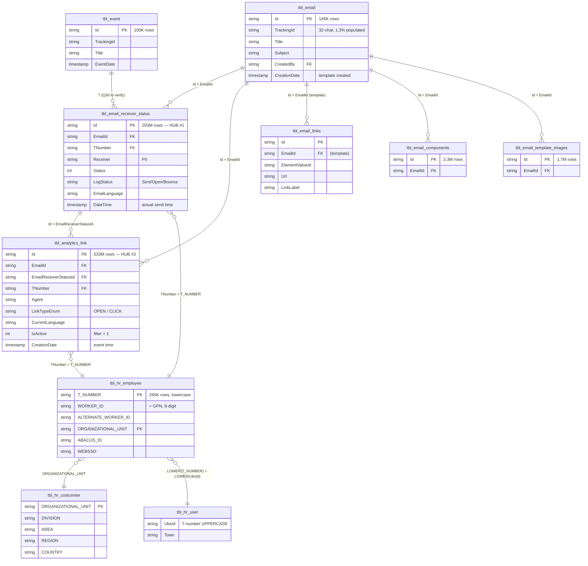

# ER-Diagramm — `imep_bronze.*`

> Erweiterte Version von Section 2 des [architecture_diagram.md](../architecture_diagram.md). Zeigt die vollständige Bronze-Topologie für iMEP mit allen Join-Keys, Row-Counts und Cross-Links zu HR.

---

## Vollständige Bronze-Topologie

---

## Volumina & Refresh-Cadence

| Tabelle | Rows | Refresh | Pattern |
|---|---|---|---|
| `tbl_email_receiver_status` | **293M** | 2×/Tag @ 00:00/12:00 UTC | MERGE full-table upsert (27-72M/run) |
| `tbl_analytics_link` | **533M** | 2×/Tag @ 00:00/12:00 UTC | MERGE **incremental** (3.7-8.5K/run) |
| `tbl_email` | 145K | 2×/Tag @ 00:00/12:00 UTC | MERGE full-table upsert |
| `tbl_hr_employee` | 265K | 2×/Tag | MERGE full-table upsert |
| `tbl_email_components` | 3.3M | 2×/Tag | MERGE |
| `tbl_email_template_images` | 1.7M | 2×/Tag | MERGE |
| `tbl_event` | 100K | 2×/Tag | MERGE |

---

## Drei Join-Typen in dieser Domain

### 1. Mailing-centric (starts from `tbl_email`)

Für "Was passierte mit dem Mailing X?". Siehe [imep_bronze_email_events.md](../joins/imep_bronze_email_events.md).

### 2. Person-centric (starts from `tbl_hr_employee`)

Für "Welche Engagement-Events hatte Person X?". Nur möglich über die beiden Hub-Tabellen `tbl_email_receiver_status` und `tbl_analytics_link` — **SharePoint-Seite hat keinen äquivalenten Person-Key** (Q27).

### 3. HR-Enrichment (from any TNumber-bearing table)

Für "Reichere meinen Engagement-Fact um Region/Division an". Siehe [hr_enrichment.md](../joins/hr_enrichment.md).

---

## Wichtige Beobachtungen

- **Zwei Full-Key-Hubs**: Nur `tbl_email_receiver_status` und `tbl_analytics_link` führen gleichzeitig `Id + EmailId + TNumber` (Q27). Das sind die einzigen Tabellen mit **person-level engagement granularity**.
- **`TrackingId`-Scope**: In Bronze nur auf `tbl_email` und `tbl_event`. **Nie** auf Engagement-Tabellen. Wenn du eine TrackingId in einem Join brauchst, musst du sie über `tbl_email.Id = EmailId` herzholen.
- **`tbl_email_links` vs `tbl_analytics_link`**: Nicht verwechseln. `tbl_email_links` ist das Template-URL-Inventory (statisch), `tbl_analytics_link` die Event-Fact-Table (Open/Click).
- **HR-Link-Reihenfolge**: Engagement-Tabelle → `tbl_hr_employee` → `tbl_hr_costcenter` (via `ORGANIZATIONAL_UNIT`). `tbl_hr_user` bietet zusätzliche Felder (Town), nicht notwendig für Region/Division.

---

## Referenzen

- [Section 2 in architecture_diagram.md](../architecture_diagram.md) — Originalversion
- [Join Strategy Contract](../joins/join_strategy_contract.md)
- Card per Tabelle: [tbl_email](../tables/imep/tbl_email.md), [tbl_email_receiver_status](../tables/imep/tbl_email_receiver_status.md), [tbl_analytics_link](../tables/imep/tbl_analytics_link.md)
