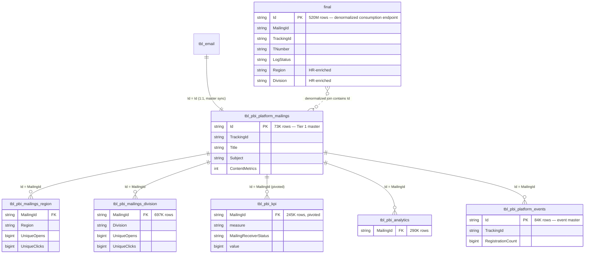

# ER-Diagramm — `imep_gold.*`

> Gold-Topologie für iMEP. **5-Tier-Architektur** (Q16). Alle Tabellen joinen via `MailingId = tbl_pbi_platform_mailings.Id = tbl_email.Id` zurück zum Master. Tier-Zuordnung zum Teil noch via Q29 zu verifizieren.

---

## Tier-Struktur



---

## Volumina & Refresh

| Tabelle | Rows | Refresh | Pattern |
|---|---|---|---|
| **`final`** | **~520M** | **2×/Tag @ ~00:23/12:25 UTC** | **CTAS Full Rebuild** ⚠️ |
| `tbl_pbi_platform_mailings` | 73K | 2×/Tag | CTAS |
| `tbl_pbi_platform_events` | 84K | 2×/Tag | CTAS |
| `tbl_pbi_analytics` | 290K | 2×/Tag | CTAS |
| `tbl_pbi_kpi` | 245K | 2×/Tag | CTAS |
| `tbl_pbi_mailings_region` | 73K | 2×/Tag | CTAS |
| `tbl_pbi_mailings_division` | 697K | 2×/Tag | CTAS |
| (1 weitere) | 1,384K | 2×/Tag | CTAS |

**Alle Gold-Tables werden per CTAS komplett neu aufgebaut** — keine Inkrementalität. Refresh-Window: 00:23 und 12:25 UTC (siehe Q28).

---

## Zwei parallele Daten-Pfade in Gold

### Pfad 1: Master-Detail (Tier 1 → Tier 2/3)

```
tbl_email (Bronze)
    │ [1:1 CTAS]
    ▼
tbl_pbi_platform_mailings (Tier 1, 73K)
    │
    ├──► tbl_pbi_mailings_region    (aggregiert × Region)
    ├──► tbl_pbi_mailings_division  (aggregiert × Division)
    ├──► tbl_pbi_kpi                (pivoted measures)
    └──► tbl_pbi_analytics
```

**Wann nutzen**: Für aggregierte Metriken pro Mailing × Dimension. Kleiner, schneller als `final`.

### Pfad 2: Denormalisierter Event-Stream (`final`)

```
tbl_email                           ┐
tbl_email_receiver_status           ├──[CTAS Full Rebuild]──► final (520M)
tbl_analytics_link                  │
tbl_hr_employee + tbl_hr_costcenter │
                                    ┘
```

**Wann nutzen**: Für Event-Level-Queries mit HR-Context, ohne manuelles Joinen. Default für Dashboards.

---

## Die pivotierte `tbl_pbi_kpi` — Vorsicht beim Aggregieren

`tbl_pbi_kpi` ist **nicht** im gewöhnlichen Wide-Format. Stattdessen:

| MailingId | measure | MailingReceiverStatus | value |
|---|---|---|---|
| `a1b2c3...` | `OpenCount` | `Open` | 1523 |
| `a1b2c3...` | `ClickCount` | `Click` | 189 |
| `a1b2c3...` | `SentCount` | `Sent` | 8500 |

Für Dashboard-Konsumption muss pivotiert werden:

```sql
SELECT MailingId,
       MAX(CASE WHEN measure = 'SentCount'  THEN value END) AS sent,
       MAX(CASE WHEN measure = 'OpenCount'  THEN value END) AS opened,
       MAX(CASE WHEN measure = 'ClickCount' THEN value END) AS clicked
FROM   imep_gold.tbl_pbi_kpi
GROUP BY MailingId
```

---

## NULL-Semantik in den Tier-3-Aggregaten (Q21)

Bei `tbl_pbi_mailings_region`, `_division`:

- **`UniqueOpens NULL ~28-35%`** — das sind Mailings ohne ein einziges Open-Event in der entsprechenden Region. NICHT als Datenfehler interpretieren.
- **`UniqueClicks NULL ~66-81%`** — Mailings ohne Clicks in der Region. Click-Rate ist naturgemäss niedriger als Open-Rate.
- **Match-Rate Mailing ↔ Tier-3**: 72-98% — nicht alle Mailings haben überhaupt Tier-3-Einträge.

Semantische NULLs, keine Defekte. Für Aggregationen `COALESCE(value, 0)` nutzen.

---

## Offene Verifikationspunkte (Q29/Q30)

- **Exakter Tier-Aufbau**: Welche Tabelle gehört zu welchem Tier? Q29 (Shape-Analyse) ordnet zu.
- **Label-Verwirrung**: `final` vs. `tbl_pbi_platform_mailings` — welche trägt die 520M Rows? Q30 klärt via `DESCRIBE EXTENDED`.
- **Spalten-Mapping im `final`**: Welche Bronze-Spalte landet wo? Für Lineage-Dokumentation.

---

## Referenzen

- [final.md](../tables/imep_gold/final.md)
- [join_strategy_contract.md](../joins/join_strategy_contract.md) — Refresh-Window-Regeln
- Memory: `imep_gold_full_inventory.md`, `imep_gold_tier3_schemas_q21.md`, `imep_pipeline_ops_q28_findings.md`
