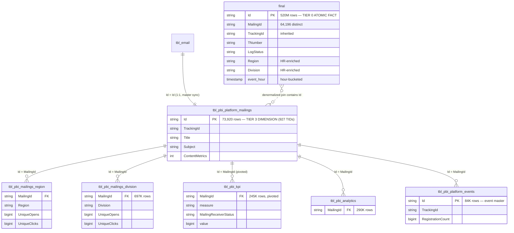

# ER Diagram — `imep_gold.*`

> Gold topology for iMEP. **Strict 4-tier hierarchy** (31 tables classified). All tables join via `MailingId = tbl_pbi_platform_mailings.Id = tbl_email.Id` back to the master. `final` is the only Tier-0 atomic fact and carries 520M rows.

---

## 4-Tier Hierarchy

| Tier | Role | # Tables | Representatives |
|---|---|---|---|
| **Tier 0 — Atomic Fact** | Per-recipient × Event × Hour | **1** | `final` (520M, 64K mailings) |
| **Tier 1 — Timespan × Dim Aggregates** | 24h / 72h / 1w / 15w / 15m+ × Date/DateHour/DivArea/RegCntry | **15** | `dateonly`, `datetime`, `divarea`, `regcntry` variants |
| **Tier 2 — Per-Mailing Summaries** | UniqueOpens/UniqueClicks per Mailing × Dim | ~8 | `mailingreceiver_*`, `engagement` (1.8M, 117K mailings — mixed mail+event!), `log_mail` |
| **Tier 3 — Platform & Reference Dims** | Master + lookup tables | ~7 | `tbl_pbi_platform_mailings` (73,920 / 927 TIDs), `tbl_pbi_platform_events` (84,052) |

---

## Central Tier Relations



---

## Volumes & Write Patterns

| Table | Rows | Pattern |
|---|---|---|
| **`final`** | **~520M** | **Full Rebuild** ⚠️ |
| `tbl_pbi_platform_mailings` | 73K | Full Rebuild |
| `tbl_pbi_platform_events` | 84K | Full Rebuild |
| `tbl_pbi_analytics` | 290K | Full Rebuild |
| `tbl_pbi_kpi` | 245K | Full Rebuild |
| `tbl_pbi_mailings_region` | 73K | Full Rebuild |
| `tbl_pbi_mailings_division` | 697K | Full Rebuild |
| (1 other) | 1,384K | Full Rebuild |

**Every Gold table is rebuilt from scratch by Full Rebuild (no incrementality)** — no incrementality. Refresh cadence intentionally not documented; we do not have a complete job-scheduler overview.

---

## Two parallel data paths in Gold

### Path 1: Master-Detail (Tier 1 → Tier 2/3)

```
tbl_email (Bronze)
    │ [1:1 Full Rebuild]
    ▼
tbl_pbi_platform_mailings (Tier 1, 73K)
    │
    ├──► tbl_pbi_mailings_region    (aggregated × Region)
    ├──► tbl_pbi_mailings_division  (aggregated × Division)
    ├──► tbl_pbi_kpi                (pivoted measures)
    └──► tbl_pbi_analytics
```

**When to use**: aggregated metrics per Mailing × Dimension. Smaller, faster than `final`.

### Path 2: Denormalized event stream (`final`)

```
tbl_email                           ┐
tbl_email_receiver_status           ├──[Full Rebuild]──► final (520M)
tbl_analytics_link                  │
tbl_hr_employee + tbl_hr_costcenter │
                                    ┘
```

**When to use**: event-level queries with HR context, without manual joins. Default for dashboards.

---

## The pivoted `tbl_pbi_kpi` — careful when aggregating

`tbl_pbi_kpi` is **not** in the usual wide format. Instead:

| MailingId | measure | MailingReceiverStatus | value |
|---|---|---|---|
| `a1b2c3...` | `OpenCount` | `Open` | 1523 |
| `a1b2c3...` | `ClickCount` | `Click` | 189 |
| `a1b2c3...` | `SentCount` | `Sent` | 8500 |

For dashboard consumption it must be pivoted:

```sql
SELECT MailingId,
       MAX(CASE WHEN measure = 'SentCount'  THEN value END) AS sent,
       MAX(CASE WHEN measure = 'OpenCount'  THEN value END) AS opened,
       MAX(CASE WHEN measure = 'ClickCount' THEN value END) AS clicked
FROM   imep_gold.tbl_pbi_kpi
GROUP BY MailingId
```

---

## NULL semantics in the Tier-3 aggregates

For `tbl_pbi_mailings_region`, `_division`:

- **`UniqueOpens NULL ~28-35%`** — these are mailings without a single open event in the corresponding region. Do NOT interpret as a data defect.
- **`UniqueClicks NULL ~66-81%`** — mailings with no clicks in the region. Click rate is naturally lower than open rate.
- **Match rate Mailing ↔ Tier-3**: 72-98% — not every mailing has Tier-3 entries at all.

Semantic NULLs, not defects. Use `COALESCE(value, 0)` for aggregations.

---

## Physical Storage

- All 31 Gold tables sit in the **shared Gold ADLS account** together with `sharepoint_gold.*` → cross-channel joins inside Fabric/Spark without cross-account auth
- Path pattern: `abfss://gold@<gold-acc>/.../final` and `/tbl_pbi/*` (+ 1 outlier `/imep/tbl_active_employee_month`)
- External Delta, produced by **a single orchestration notebook** (Spark 3.2.1) — no managed Pipeline
- **⚠️ Zero partitioning** on every table — the largest structural performance gap; full scans on any query without tight filters

## Engagement table anomaly

`engagement` (Tier 2, 1.8M rows) carries **117,185 distinct mailingIds**, while `tbl_pbi_platform_mailings` contains only 73,930. The delta (~44K) = event IDs from `tbl_pbi_platform_events`. iMEP Gold treats **emails + events as the same engagement unit** in Tier-2 aggregates. For mailing-specific analyses explicitly filter down to the 73K mailing IDs.

---

## References

- [final.md](../tables/imep_gold/final.md)
- [join_strategy_contract.md](../joins/join_strategy_contract.md) — rules for working with Full Rebuild tables
- Memory: `imep_gold_full_inventory.md`, `imep_gold_tier3_schemas_q21.md`, `imep_pipeline_ops_q28_findings.md`

---

## Sources

Genie sessions backing the statements on this page: [Q21](../sources.md#q21), [Q28](../sources.md#q28), [Q29](../sources.md#q29), [Q30](../sources.md#q30). See [sources.md](../sources.md) for the full index.
