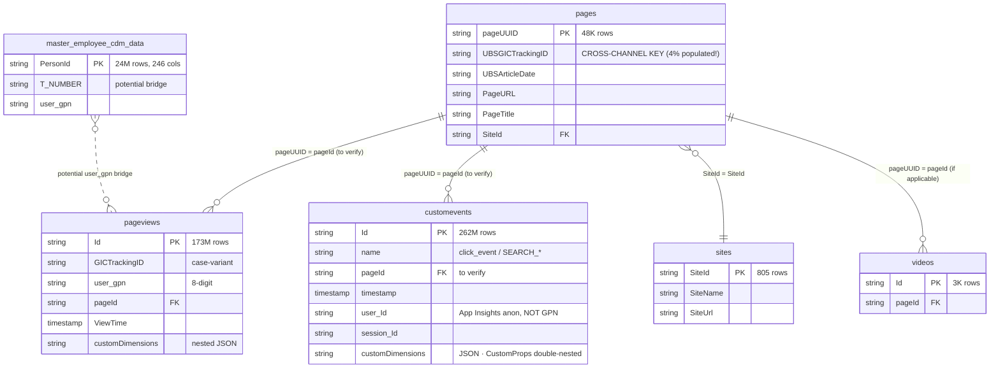

# ER Diagram — `sharepoint_bronze.*`

> Bronze topology for the SharePoint intranet. Key distinction: **`pages` (inventory, with TrackingID)** vs. **`pageviews` and `customevents` (interactions, no TrackingID)**. Cross-channel attribution **always** runs through `pages`.

---

## Full Bronze topology



---

## Volumes & Write Patterns

| Table | Rows | Pattern |
|---|---|---|
| `customevents` | **262M** | (presumably Append) |
| `pageviews` | **173M** | **Append WRITE**, 7 bursts within 1 minute (API pagination) |
| `master_employee_cdm_data` | 24M | (TBD) |
| `pages` | 48K | **MERGE daily snapshot replace** |
| `videos` | 3K | (TBD) |
| `sites` | 805 | (TBD) |

Plus historical snapshots:
- `pageviews_1_july_till_17_oct` (20.6M)
- `pageviews_08022024` (19M)
- `customevents_history` (13.3M)

---

## Critical distinction: Inventory vs. Interactions

### `pages` = Inventory (dimension)

**Contains**: every SharePoint page along with its metadata, including `UBSGICTrackingID` (where set).

**What you find here**:
- "Which articles exist?"
- "Which pages belong to TrackingID Y?"
- "Which site hosts this page?"

**What you do NOT find here**:
- How often a page was viewed
- Who clicked it and when

### `pageviews` / `customevents` = Interactions (fact)

**Contains**: every single interaction of a user with a page.

**What you find here**:
- "Who read which page and when?"
- "Which device?"
- "Which custom event was triggered?"

**What you do NOT find here**:
- The TrackingID directly — you must **always** join it in via `pages`.

### `customevents` — schema specifics

`customevents` carries clicks (`name == 'click_event'`), searches (`name`
starts with `SEARCH_`), and video actions in a single stream. The business
payload sits inside `customDimensions` as a **double-nested JSON** — the outer
JSON has exactly one key, `CustomProps`, whose value is itself a JSON string.
Click events are flat (Level 2), search events nest up to Level 4.

`CustomProps` keys for `click_event` (verified against the Clicks project):

| Bucket | Keys |
|---|---|
| Person | `GPN`, `Email` |
| Page context | `SiteID`, `SiteName`, `PageId`, `PageName`, `PageURL`, `PageStatus`, `ContentType`, `ContentOwner`, `NewsCategory`, `PublishingDate` |
| Click detail | `ComponentName`, `Link_Type`, `Link_label`, `Link_address`, `Link_ancestors` |
| Download detail | `FileType_Label`, `FileName_Label` |
| Targeting (newer) | `Theme`, `Topic`, `TargetOrganisation`, `TargetRegion`, `refUri` |
| Video sub-domain | `Video_Action`, `Video_Id`, `Video_Type`, `Video_Duration` |

> ⚠️ **No `CammsTrackingID`/`UBSGICTrackingID` on `customevents`** — only
> `pageViews` carries it. Cross-channel attribution for clicks therefore runs
> via `pageId → pages.pageUUID → pages.UBSGICTrackingID`.

Full table card: [customevents.md](../tables/sharepoint/customevents.md).

```sql
-- The canonical SP Bronze chain
SELECT pv.user_gpn, pv.ViewTime, p.UBSGICTrackingID, p.PageTitle
FROM   sharepoint_bronze.pageviews pv
JOIN   sharepoint_bronze.pages     p ON p.pageUUID = pv.pageId
WHERE  p.UBSGICTrackingID IS NOT NULL
```

---

## Person identity in SharePoint Bronze

SharePoint carries **no TNumber** natively. Instead:

- `pageviews.user_gpn` — GPN in 8-digit format (`00100200`)
- `master_employee_cdm_data.T_NUMBER` — potential bridge (hypothesised, not fully validated)

**The confirmed bridge runs through iMEP's HR table**:

```sql
-- gpn (8-digit) → TNumber via iMEP HR
SELECT pv.user_gpn, hr.T_NUMBER
FROM   sharepoint_bronze.pageviews    pv
JOIN   imep_bronze.tbl_hr_employee    hr ON hr.WORKER_ID = pv.user_gpn
```

See [hr_enrichment.md](../joins/hr_enrichment.md).

---

## Key observations

- **Schema inconsistency**: `pages.UBSGICTrackingID` vs. `pageviews.GICTrackingID` — different column names for the same business key (plus case variants). Harmonization should happen in the Silver layer (`sharepoint_silver.webpage` uses `gICTrackingID`).
- **1:1 URL↔TID mapping**: at the `pages` level every URL has at most one TID. Safe for URL-based aggregation.
- **Append bursts on pageviews**: 7 quick writes within 1 minute (00:15-00:16 UTC). This is not streaming — API pagination, but very short windows. Best signal candidate for near-real-time dashboards.
- **`customevents` is nearly 2× the size of `pageviews`** (262M vs. 173M). Both cover related but different interaction scopes.

---

## References

- [pages.md](../tables/sharepoint/pages.md) — the cross-channel bridge
- [customevents.md](../tables/sharepoint/customevents.md) — click + search + video stream (262M)
- [join_strategy_contract.md](../joins/join_strategy_contract.md) — coverage rules
- [`kql/customevents_clicks.kql`](../../kql/customevents_clicks.kql) — flatten exporter for click_event
- Memory: `sharepoint_pages_inventory.md`, `sharepoint_gold_inventory.md`, `appinsights_source.md`

---

## Sources

Genie sessions backing the statements on this page: [Q17](../sources.md#q17), [Q25](../sources.md#q25), [Q28](../sources.md#q28), [Q30](../sources.md#q30). See [sources.md](../sources.md) for the full index.
