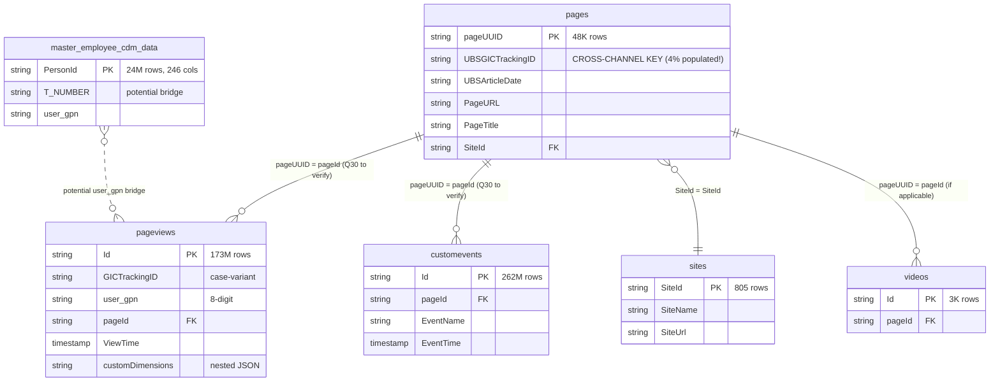

# ER-Diagramm — `sharepoint_bronze.*`

> Bronze-Topologie für SharePoint-Intranet. Zentrale Unterscheidung: **`pages` (Inventory, mit TrackingID)** vs. **`pageviews` und `customevents` (Interactions, ohne TrackingID)**. Cross-Channel-Attribution geht **immer** über `pages`.

---

## Vollständige Bronze-Topologie



---

## Volumina & Refresh-Cadence

| Tabelle | Rows | Refresh | Pattern |
|---|---|---|---|
| `customevents` | **262M** | 1×/Tag @ 02:00 UTC | (Q28: vermutlich Append) |
| `pageviews` | **173M** | 1×/Tag @ 02:00 UTC | **Append WRITE**, 7 Bursts in 1 Minute (API-Pagination) |
| `master_employee_cdm_data` | 24M | 1×/Tag | (TBD) |
| `pages` | 48K | 1×/Tag @ 02:00 UTC | **MERGE Daily Snapshot Replace** |
| `videos` | 3K | 1×/Tag | (TBD) |
| `sites` | 805 | 1×/Tag | (TBD) |

Plus historische Snapshots:
- `pageviews_1_july_till_17_oct` (20.6M)
- `pageviews_08022024` (19M)
- `customevents_history` (13.3M)

---

## Kritische Unterscheidung: Inventory vs. Interactions

### `pages` = Inventory (Dimension)

**Enthält**: Alle SharePoint-Pages mit ihren Metadaten, inklusive `UBSGICTrackingID` (wo gesetzt).

**Was du hier findest**:
- "Welche Artikel existieren?"
- "Welche Pages gehören zu TrackingID Y?"
- "Welche Site hostet diese Page?"

**Was du hier NICHT findest**:
- Wie oft wurde eine Page aufgerufen
- Wer hat sie wann angeklickt

### `pageviews` / `customevents` = Interactions (Fact)

**Enthält**: Jede einzelne Interaction eines Users mit einer Page.

**Was du hier findest**:
- "Wer hat welche Page wann gelesen?"
- "Welches Device?"
- "Welches Custom-Event wurde getriggert?"

**Was du hier NICHT findest**:
- Direkt die TrackingID — diese musst du **immer** via `pages` herbeijoinen.

```sql
-- Die kanonische SP-Bronze-Kette
SELECT pv.user_gpn, pv.ViewTime, p.UBSGICTrackingID, p.PageTitle
FROM   sharepoint_bronze.pageviews pv
JOIN   sharepoint_bronze.pages     p ON p.pageUUID = pv.pageId
WHERE  p.UBSGICTrackingID IS NOT NULL
```

---

## Person-Identity in SharePoint-Bronze

SharePoint trägt **kein TNumber** nativ. Stattdessen:

- `pageviews.user_gpn` — GPN im 8-digit-Format (`00100200`)
- `master_employee_cdm_data.T_NUMBER` — potentielle Bridge (Q17 hypothesiert, nicht final validiert)

**Die bestätigte Bridge läuft über iMEP's HR-Tabelle** (Q3b):

```sql
-- gpn (8-digit) → TNumber via iMEP HR
SELECT pv.user_gpn, hr.T_NUMBER
FROM   sharepoint_bronze.pageviews    pv
JOIN   imep_bronze.tbl_hr_employee    hr ON hr.WORKER_ID = pv.user_gpn
```

Siehe [hr_enrichment.md](../joins/hr_enrichment.md).

---

## Wichtige Beobachtungen

- **Schema-Inkonsistenz**: `pages.UBSGICTrackingID` vs. `pageviews.GICTrackingID` — unterschiedliche Spaltennamen für denselben fachlichen Key (plus Case-Varianten). Harmonisierung sollte im Silver-Layer passieren (`sharepoint_silver.webpage` nutzt `gICTrackingID`).
- **1:1 URL↔TID-Mapping** (Q25): Auf `pages`-Ebene hat jede URL maximal eine TID. Safe für URL-basierte Aggregation.
- **Append-Bursts bei pageviews**: 7 schnelle Writes innerhalb 1 Minute (00:15-00:16 UTC). Das ist kein Streaming — API-Pagination, aber sehr kurze Fenster. Für near-real-time-Dashboards der beste Signal-Kandidat.
- **`customevents` ist fast 2× so gross wie `pageviews`** (262M vs 173M). Beide decken verwandte, aber unterschiedliche Interaction-Scopes.

---

## Referenzen

- [pages.md](../tables/sharepoint/pages.md) — Die Cross-Channel-Brücke
- [join_strategy_contract.md](../joins/join_strategy_contract.md) — Coverage-Regeln
- Memory: `sharepoint_pages_inventory.md`, `sharepoint_gold_inventory.md`
