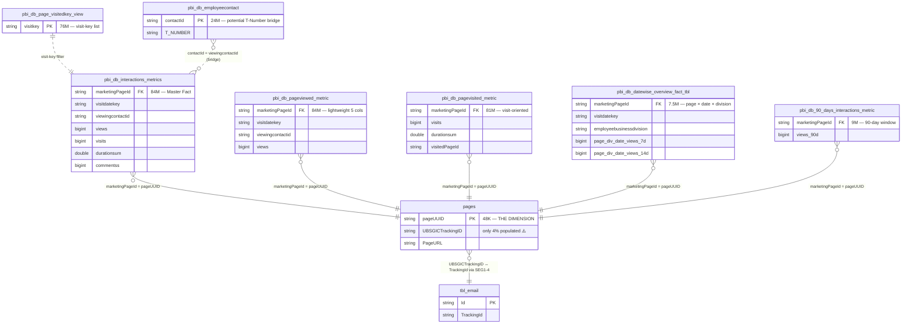
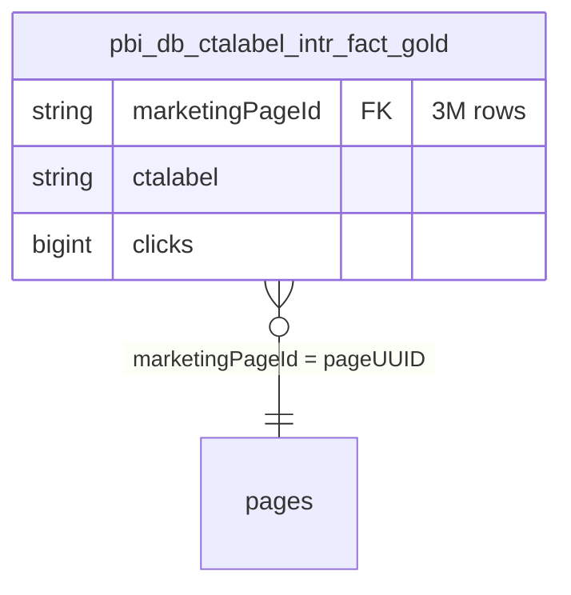

# ER-Diagramm — `sharepoint_gold.*`

> Gold-Topologie für SharePoint. **Die FK-Kette läuft über `marketingPageId`** — alle Gold-Metric-Tables referenzieren zurück zu `sharepoint_bronze.pages.pageUUID`. **Keine direkte TrackingID auf den Gold-Facts!** Cross-Channel-Attribution geht immer über `pages`.

---

## FK-Kette — der zentrale Weg



---

## Volumina & Use-Cases

| Tabelle | Rows | Cols | Use-Case |
|---|---|---|---|
| `pbi_db_interactions_metrics` | **84M** | 11 | **Default** — Views + Visits + Duration + Comments in einer Tabelle |
| `pbi_db_pageviewed_metric` | 84M | 5 | Nur View-Counts, superschnell für fast aggregation |
| `pbi_db_pagevisited_metric` | 81M | 9 | Visit-oriented mit Dedup-Logik |
| `pbi_db_datewise_overview_fact_tbl` | **7.5M** | 31 | Pre-aggregated page × date × division, Rolling Windows (7/14/21/28d) |
| `pbi_db_90_days_interactions_metric` | 9M | 11 | 90-Tage-Window, klein für Short-Term-Dashboards |
| `pbi_db_page_visitedkey_view` | 76M | 1 | Visit-Key-Filter-View (nur GUID-Liste) |
| `pbi_db_employeecontact` | **24M** | 17 | **Potentielle Person-Bridge** (viewingcontactid ↔ T_NUMBER) |

Plus `sharepoint_clicks_gold.pbi_db_ctalabel_intr_fact_gold` (3M) für CTA-Click-Attribution.

---

## Drei kritische Regeln

### Regel 1 — Gold-Metriken ohne `pages`-JOIN sind unattribuiert

```sql
-- FALSCH — ergibt nur Rohzahlen ohne Cross-Channel-Context
SELECT SUM(views) FROM sharepoint_gold.pbi_db_interactions_metrics;

-- RICHTIG — ermöglicht Attribution via TrackingID
SELECT p.UBSGICTrackingID, SUM(m.views) AS views
FROM   sharepoint_gold.pbi_db_interactions_metrics m
JOIN   sharepoint_bronze.pages p ON p.pageUUID = m.marketingPageId
WHERE  p.UBSGICTrackingID IS NOT NULL
GROUP BY p.UBSGICTrackingID
```

### Regel 2 — ~96% der Rows sind "untracked"

Nur 4% der Pages haben TrackingID. Das heisst: Von 84M Interaction-Rows sind **~80M unattribuierbar**. Dashboard muss das explizit machen — z.B. zwei getrennte Sektionen.

### Regel 3 — `viewingcontactid` ≠ TNumber

Die SharePoint-native Person-ID ist ein GUID (`viewingcontactid`), nicht TNumber. Für Cross-Channel-Joins mit iMEP-Person-Daten braucht's entweder:

- **`pbi_db_employeecontact`** als Bridge (Q17 hypothesiert, noch nicht validiert)
- oder Rückgriff auf `sharepoint_bronze.pageviews.user_gpn` + iMEP-HR-Bridge

---

## Alternative-Path — CTA-Clicks

Für Call-to-Action-spezifische Attribution gibt es ein separates Schema:



Nutzbar z.B. für "Welcher CTA-Button auf welcher Page wurde wie oft geklickt".

---

## Alle Wege führen über `pages`

**Keine der Gold-Metric-Tables trägt `GICTrackingID` oder `UBSGICTrackingID` direkt.** Das ist bewusste Normalisierung — die TrackingID lebt nur auf der Dimension.

```
Any sharepoint_gold.pbi_db_* metric
              │
              │ marketingPageId
              ▼
sharepoint_bronze.pages
              │
              │ UBSGICTrackingID (if populated)
              ▼
Cross-channel match to imep_bronze.tbl_email.TrackingId (SEG1-4)
```

---

## Referenzen

- [pbi_db_interactions_metrics.md](../tables/sharepoint_gold/pbi_db_interactions_metrics.md) — Haupt-Fact-Card
- [pages.md](../tables/sharepoint/pages.md) — Die Dimension
- [sharepoint_gold_to_pages.md](../joins/sharepoint_gold_to_pages.md) — Join-Recipe
- Memory: `sharepoint_gold_inventory.md`, `sharepoint_gold_schemas_q22.md`
