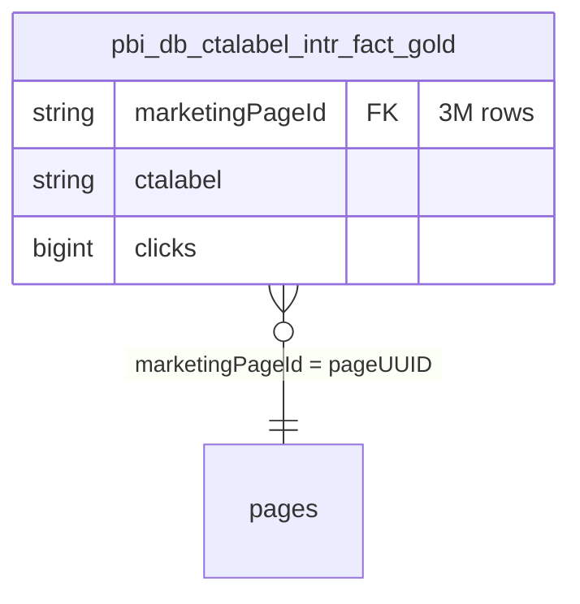

# ER Diagram — `sharepoint_gold.*`

> Gold topology for SharePoint. **Strict 4-tier hierarchy** (20 tables + 3 Video sub-domain + 2 views). The FK chain runs through `marketingPageId` — all Gold metric tables reference back to `sharepoint_bronze.pages.pageUUID`. **No direct TrackingID on the Gold facts!** Cross-channel attribution always runs through `pages`.

---

## 4-Tier Hierarchy

| Tier | Role | # Tables | Representatives |
|---|---|---|---|
| **Tier 0 — Atomic Interaction Facts** | Per-visitor × Page × Date | **4** | `pbi_db_interactions_metrics` (84M), `pageviewed_metric` (84M), `pagevisited_metric` (81M), `90_days_interactions_metric` (9M) |
| **Tier 1 — Pre-Aggregated Overview** | Rolling windows (7/14/21/28d) across Page × Date × Division | **3** | `datewise_overview_fact_tbl` (7.5M, 27 cols) |
| **Tier 2 — Engagement / Social Signals** | Likes, Comments, CTA | **3** | `pageliked_metric` (400K), `pagecommented_metric` (500K), `page_like_int_fact` (30K) |
| **Tier 3 — Dimension Tables** | Person + Page + Calendar + Referrer | **~7** | `employeecontact` (24.3M, potential Person bridge), `website_page_inventory`, `calendar`, `referer_application` |

**Plus Video sub-domain (3 tables)** — the only tables in the system running through a **managed Declarative Pipeline** (Spark 3.5.2/4.0.0, ChangeDataFeed enabled, proper comments). The rest is notebook-based Full Rebuild (Spark 3.2.1).

**Plus 2 Views** (no physical storage): `pbi_db_page_visitedkey_view`, `pbi_db_website_page_view`.

---

## FK Chain — the central path


---

## Volumes & Use-Cases

| Table | Rows | Cols | Use-Case |
|---|---|---|---|
| `pbi_db_interactions_metrics` | **84M** | 11 | **Default** — Views + Visits + Duration + Comments in a single table |
| `pbi_db_pageviewed_metric` | 84M | 5 | View counts only, very fast for fast aggregation |
| `pbi_db_pagevisited_metric` | 81M | 9 | Visit-oriented with dedup logic |
| `pbi_db_datewise_overview_fact_tbl` | **7.5M** | 31 | Pre-aggregated page × date × division, rolling windows (7/14/21/28d) |
| `pbi_db_90_days_interactions_metric` | 9M | 11 | 90-day window, small for short-term dashboards |
| `pbi_db_page_visitedkey_view` | 76M | 1 | Visit-key filter view (GUID list only) |
| `pbi_db_employeecontact` | **24M** | 17 | **Potential Person bridge** (viewingcontactid ↔ T_NUMBER) |

Plus `sharepoint_clicks_gold.pbi_db_ctalabel_intr_fact_gold` (3M) for CTA click attribution.

---

## Three critical rules

### Rule 1 — Gold metrics without `pages` JOIN are unattributed

```sql
-- WRONG — yields only raw counts without cross-channel context
SELECT SUM(views) FROM sharepoint_gold.pbi_db_interactions_metrics;

-- RIGHT — enables attribution via TrackingID
SELECT p.UBSGICTrackingID, SUM(m.views) AS views
FROM   sharepoint_gold.pbi_db_interactions_metrics m
JOIN   sharepoint_bronze.pages p ON p.pageUUID = m.marketingPageId
WHERE  p.UBSGICTrackingID IS NOT NULL
GROUP BY p.UBSGICTrackingID
```

### Rule 2 — ~96% of rows are "untracked"

Only 4% of pages have a TrackingID. That means: out of 84M interaction rows, **~80M are unattributable**. The dashboard must make this explicit — e.g. two separate sections.

### Rule 3 — `viewingcontactid` ≠ TNumber

The SharePoint-native person ID is a GUID (`viewingcontactid`), not TNumber. For cross-channel joins with iMEP person data you need either:

- **`pbi_db_employeecontact`** as a bridge (hypothesised, not yet validated)
- or fall back to `sharepoint_bronze.pageviews.user_gpn` + the iMEP HR bridge

---

## Alternative path — CTA clicks

For call-to-action specific attribution there is a separate schema:



Usable for example for "Which CTA button on which page was clicked how often".

---

## All paths lead through `pages`

**None of the Gold metric tables carry `GICTrackingID` or `UBSGICTrackingID` directly.** This is deliberate normalization — the TrackingID lives only on the dimension.

```
Any sharepoint_gold.pbi_db_* metric
              │
              │ marketingPageId
              ▼
sharepoint_bronze.pages
              │
              │ UBSGICTrackingID (if populated)
              ▼
Cross-channel match to imep_bronze.tbl_email.TrackingId (SEG1-2)
```

---

## Physical Storage

**Two pipeline families** in SharePoint Gold — visible in the ADLS paths:

- **Family 1 "Employee Analytics" (16 tables)** — `abfss://gold@<gold-acc>/.../employee_analytics/pbi_db_*`, Spark 3.2.1, notebook-based Full Rebuild, no pipeline metadata
- **Family 2 "Video Analytics" (3 tables)** — `abfss://gold@<gold-acc>/.../sharepoint_gold/sharepoint_gold/pbi_db_*`, Spark 3.5.2/4.0.0, managed Declarative Pipeline (`pipelines.pipelineId`), ChangeDataFeed enabled, proper table comments

**Gold co-location with iMEP Gold**: both schemas sit in the same ADLS Gold account → cross-channel joins inside Fabric/Spark without cross-account auth.

**⚠️ Zero partitioning** on all 20 tables — `interactions_metrics` (84M) + `pageviewed_metric` (84M) are fully scanned on every query without a date filter.

---

## References

- [pbi_db_interactions_metrics.md](../tables/sharepoint_gold/pbi_db_interactions_metrics.md) — main fact card
- [pages.md](../tables/sharepoint/pages.md) — the dimension
- [sharepoint_gold_to_pages.md](../joins/sharepoint_gold_to_pages.md) — join recipe
- Memory: `sharepoint_gold_inventory.md`, `sharepoint_gold_schemas_q22.md`

---

## Sources

Genie sessions backing the statements on this page: [Q17](../sources.md#q17), [Q29](../sources.md#q29), [Q30](../sources.md#q30). See [sources.md](../sources.md) for the full index.
