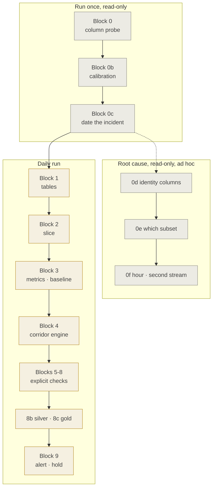

# Engineering Notes — `dq_checks_draft.sql`, block by block

**Audience:** Head Engineer and anyone maintaining the checks
**Companion to:** [`BRD_data_integrity_monitoring.md`](BRD_data_integrity_monitoring.md)
**Implements:** [`../dq_checks_draft.sql`](../dq_checks_draft.sql)
**Date:** 2026-09-11 · **Status:** Draft, blocks 0–0c executed, 1–9 not yet run

Each section answers three questions in order: what the block is trying to
achieve, what the query actually does to achieve it, and which decisions in it
are non-obvious enough to be worth defending. BRD references point at the
requirement the block satisfies.

---

## 0. Conventions that apply everywhere

These are decisions taken once and relied on throughout. Breaking one silently
breaks several blocks.

| # | Convention | Why |
|---|---|---|
| C1 | **`CAST(\`timestamp\` AS TIMESTAMP)`, never `to_timestamp()`** | The raw value is ISO-8601 UTC with a `T` separator, milliseconds and a `Z` suffix, e.g. `2026-03-02T00:00:00.229Z`. Neither a bare `to_timestamp()` nor the pattern `yyyy-MM-dd HH:mm:ss` matches it; the first run returned NULL for all 2.8M rows. `CAST` accepts ISO-8601. |
| C2 | **Range-filter on the raw string, not on the cast** | ISO-8601 sorts lexicographically in the same order as chronologically, so `` `timestamp` >= '2026-03-02' `` selects correctly *and* lets Delta skip files on min/max statistics. A predicate wrapped in `CAST` defeats file skipping. BRD NFR-02. |
| C3 | **Never window on `gmdp_date` or `gmdp_timestamp`** | Those record when the platform ingested a row. A late load would move an event into the wrong day. They have exactly one legitimate use: measuring load latency in A2. |
| C4 | **Identity ratios are daily, never pooled** | Pooling a fortnight reported 20.0 browser identities per person; the same state daily reads 3.9, because identities do not recur across days while people do. BRD §10.2, FR-DET-08. |
| C5 | **`DESCRIBE` / Spark schema, never `information_schema`** | The workspace resolves two-part names through the Hive Metastore. `information_schema` is a Unity Catalog feature and raises *Table or view not found*. BRD NFR-03. |
| C6 | **Bronze is already flat** | There is no `customDimensions` column to parse. The former CustomProps are first-class columns: `GPN`, `Email`, `PageURL`, `PageName`, `PublishingDate`, `SiteId`, `SiteName`, `GICTrackingID`. |
| C7 | **Absolute bounds sit below the healthy weekend** | Healthy weekday page views per session is 1.94–2.35 but healthy weekend is 1.59–1.71. A bound placed under the weekday would warn every Saturday. BRD FR-CAL-02. |
| C8 | **Writes only into `dq`** | Source tables are read-only. BRD NFR-04. |

### Column names, confirmed 2026-09-11

| Concept | Column | Note |
|---|---|---|
| Event time | `` `timestamp` `` | **STRING**, ISO-8601 UTC. Backtick it, it is a reserved word. |
| Person | `GPN` | Not `user_gpn`. 8-digit. Present on 100 % of rows. |
| Browser identity | `user_Id` | The SDK cookie. The column that broke. |
| Other identities | `user_AuthenticatedId`, `user_AccountId` | Application-supplied, not yet analysed. BRD OP-08. |
| Session | `session_Id` | |
| Page | `pageId` | **INT**, while the inventory keys on a GUID. BRD OP-04. |
| Ingestion | `gmdp_timestamp`, `ingestiontime` | Two stamps, relationship unconfirmed. BRD OP-05. |

---

## Run order

Blocks 0 to 0c have been executed. Blocks 0d to 0f are investigation, not
monitoring, and are not part of the daily job. Blocks 1 to 9 are the daily run
and have not yet been executed.

---

## Block 0 — Column probe

**Intent.** Establish the real schema before writing anything. Everything
downstream is named after what this block finds. BRD §11 phase 0.

**What the query does.** A single Python cell reads the Spark schema of six
tables, then prints per table which expected envelope columns are present and
which are missing, and groups every column into buckets for time, person,
identity, page, tracking and ingestion candidates.

**Non-obvious decisions.**
- Python rather than SQL, because five `DESCRIBE` statements in one `%sql` cell
  render only the last result. One cell has to answer everything in one screen.
- The magic must be the first line of its cell. An earlier version put `%python`
  in the middle of the block and could not run at all.

**What it found.** Bronze is flat (C6). `sdkVersion`, `itemCount`, `iKey` and
`appId` are all present, so checks A4, C3 and C4 run on bronze and the KQL
fallback is unnecessary. `pbi_db_employeecontact` carries `contactId` and no
employee number, so it is not the person bridge.

---

## Block 0b — Calibration probe

**Intent.** Replace guessed thresholds with measured ones, by reading the
identity ratios on a window that predates the incident. BRD FR-CAL-01, §10.1.

**What the query does.** Three fortnights in one grid: 2–15 March, 13–26 April,
and the most recent fortnight. Per window it reports page views per session,
browser identities per person, sessions per person, single-view session share,
the share of rows carrying an employee number, the distinct counts behind those
ratios, and the set of SDK versions seen.

**Non-obvious decisions.**
- The windows deliberately avoid the boundary. A window containing 8 April would
  average healthy and broken together and the baseline would be worthless.
- The single-view share needs a two-level aggregation: sessions first, then the
  share of sessions of size one. It cannot be expressed in one `GROUP BY`.

**Known limitation.** This block pools a fortnight, and pooling inflates
per-person identity counts (C4). Its 20.0 is not comparable with the 3.9 that
Block 0c measures daily. The daily figures govern.

---

## Block 0c — The transition, day by day

**Intent.** Block 0b measures how far the ratios moved but says nothing about
when or how. This dates the incident and shows the shape of the change.
BRD §3.2.

**What the query does.** Thirty days centred on 8 April, one row per day, with
the same identity ratios plus distinct people as a control and the share of
traffic on the SDK version that disappeared.

**Non-obvious decisions.**
- Distinct people runs alongside as a control. If the population moved too, the
  cause is something other than the identifier.
- The weekday is printed next to the date. Weekend traffic is roughly 5 % of a
  weekday, so a naive reading mistakes every Sunday for an outage.

**What it found.** Onset on 7 April, completion on 8 April, then a flat plateau:
a staged rollout, not a switch. The SDK version share was already zero on 25
March, so the version change is **not** the same event, which overturned an
earlier conclusion. Easter distorts 3 and 6 April, which is why the holiday
calendar became a prerequisite (BRD §10.3, OP-03).

---

## Blocks 0d–0f — Root cause

Not monitoring. Investigation aids, run on demand, feeding BRD OP-07 and OP-08.

### Block 0d — Is there still a stable identity?

**Intent.** Bronze carries three identity columns and only one is known broken.
Establish whether the application-supplied identities survived 7 April.

**What the query does.** Compares a pre-window and a post-window on three things:
the fill rate of `user_AuthenticatedId` and `user_AccountId`, the number of
distinct values of each identity column per person, and the shape of the cookie
value (average length, number of distinct lengths, presence of the separator,
one sample). A sub-query then measures what share of identifiers is ever seen on
a second day.

**How to read it.** Authenticated identities per person staying near 1 means the
cookie broke while the instrumentation did not, which makes that column both the
diagnosis and a usable replacement key. All three rising together points at SDK
initialisation. A change in length or separator means the value is being
generated rather than read back.

### Block 0e — Which subset flipped first?

**Intent.** A two-day ramp almost always has a dimension it was rolled out
along. Find it.

**What the query does.** Unpivots four dimensions (site, browser, operating
system, client type, SDK version) into one long table, then reports browser
identities per person for each value on four specific days: Tuesday 31 March
against Tuesday 7 April for the onset, and Wednesday 1 April against Wednesday 8
April for the completed break.

**Non-obvious decisions.**
- Same weekday on both sides of every comparison. Traffic composition differs by
  weekday, so a Monday-to-Wednesday comparison would confound the effect.
- 3 and 6 April are excluded because they are Easter holidays.
- A `HAVING` floor of 500 views drops the long tail, where a handful of views
  produces a meaningless ratio.

**How to read it.** A value already elevated on 7 April was in the first wave.
A value that stays near 1 on all four days was never affected and is the most
informative row on the grid.

### Block 0f — The hour, and the second stream

**Intent.** Two questions. Exactly when on 7 April did it start, and did the
click stream break at the same time.

**What the query does.** Part 1 resolves 6 to 8 April to the hour. Part 2 runs
the same ratios over `customevents` filtered to click events, day by day.

**How to read it.** A sharp edge at one hour boundary is a deployment and gives a
timestamp to search a change record with. A gradual climb points at caching or
staged traffic. If `customevents` breaks on the same day, one SDK-level change
affected both streams; if it stays flat, page-view tracking alone changed and the
click stream becomes a control group.

**Note.** `customevents` has no `id` column, so it cannot be de-duplicated the
way `pageviews` is. Only the identity columns are comparable.

---

## Block 1 — Result table and check catalogue

**Intent.** Give every check one place to write to and one place to read its
thresholds from. BRD FR-REC-01, §9.

**What it does.** Creates `dq.dq_check_result`, one row per day and check, and
`dq.check_def`, a small table holding the thresholds for every check whose rule
is "stay inside a band".

**Why the thresholds live in a table.** Fourteen checks share one evaluation
query (Block 4). Putting the bounds in a table means adding a check is an
`INSERT`, not a new branch of SQL, and it makes every threshold auditable in one
place.

**The threshold columns.** `abs_*` are absolute bounds on the metric, `rel_*`
are relative deviations from the same-weekday median, `step_*` compare the 7-day
mean with the prior 28-day mean. `NULL` means the rule does not apply.

**Important.** The identity bounds describe healthy data, so B1, B4 and B5 fail
today by design and keep failing until the source is repaired. BRD FR-CAL-03
forbids retuning them to the current state.

---

## Block 2 — The working slice

**Intent.** Read the 173M-row bronze table once per day, not once per check.
BRD NFR-01.

**What it does.** Materialises `dq.pv_window`, a 70-day slice, partitioned by
date, with every column the checks need renamed to a stable internal name.

**Non-obvious decisions.**
- The rename layer matters. If a source column is renamed upstream, exactly one
  line changes here rather than thirty lines across nine blocks.
- 70 days because the baseline needs 8 weeks of the same weekday plus headroom.
- The filter is a string range on the raw value (C2), so file skipping survives.
- `gmdp_timestamp` and `ingestiontime` are both carried through, so the
  comparison in OP-05 can be made without touching bronze again.

**Verification.** The block ends with a guard query that counts unparsed
timestamps and prints the first and last event. Run it after the first build.
A non-zero unparsed count means C1 has been violated somewhere.

---

## Block 3 — Daily metrics and the baseline

**Intent.** Turn the slice into one number per day per metric, and give every
number something to be compared against. BRD FR-DET-04, FR-DET-05.

**What it does.** Three stages. `dq.pv_daily` computes the per-day metrics,
including the two-level aggregations for single-view share and double-fire rate
and a rolling seven-day join for sessions per browser identity. `dq.gold_daily`
does the same for the gold fact. `dq.metric_daily` unpivots both into one long
table of day, metric and value. `dq.metric_baseline` then joins each day to the
same weekday over the trailing 8 weeks, takes the median and the median absolute
deviation, and computes the 7-day against prior-28-day means.

**Non-obvious decisions.**
- **Median and MAD, not mean and standard deviation.** One catastrophic day would
  drag a mean and inflate a standard deviation, widening the corridor exactly
  when it should be tightening. The median ignores it.
- **Same weekday, not the previous day.** Weekend traffic is a fraction of a
  weekday. Comparing Monday with Sunday produces a permanent false alarm.
- **`stack()` needs one type per position**, so every value is cast to `DOUBLE`
  before unpivoting. Mixed types fail at runtime, not at parse time.
- **The step comparison is separate from the corridor.** A corridor catches one
  bad day; a step catches a permanent shift that settles into a new normal, which
  is exactly what April was.

**Cost note.** The rolling seven-day self-join is the most expensive operation in
the daily run. If runtime becomes a problem (NFR-05), this is the first thing to
look at.

---

## Block 4 — The corridor engine

**Intent.** Evaluate every check whose rule is "stay inside a band" with one
piece of SQL. BRD FR-DET-01.

**What it does.** Joins `dq.metric_baseline` to `dq.check_def` on the metric
name, then a single `CASE` expression walks the rules in severity order: absolute
blocking bounds, relative blocking deviation, blocking step change, then the
warning equivalents, then the generic 3-MAD corridor. Produces A1, A4, B1, B2,
B4, B5, B8, C8, D1, D4 and D7.

**Non-obvious decisions.**
- **Order inside the `CASE` is the severity ladder.** The first match wins, so
  blocking conditions must precede warning conditions. Reordering them silently
  downgrades alerts.
- **`n_hist < 4` yields `info`, not `ok`.** A check with too little history is
  not passing, it is not yet able to judge. Recording that as `ok` would make a
  fresh deployment look healthy. BRD FR-DET-06.
- **The note carries the evidence**, including both means and the step
  percentage, so an alert is actionable without opening a notebook.

**To add a check.** Add its metric to `dq.pv_daily` and to the `stack()` in
`dq.metric_daily`, then insert one row into `dq.check_def`. No change here.

---

## Blocks 5–8 — The explicit checks

Checks whose rule is not a corridor. Each writes its own result row.

| Block | Checks | What it does | Worth knowing |
|---|---|---|---|
| 5 | A2, A5, A6, A7 | Freshness per layer, duplicate rate on the composite key, the three-layer row tie-out, and late-arrival growth | A5 uses the composite key (second-truncated time, browser, session, page) because the source `id` proved not to be event-unique in real exports. A7 uses Delta time travel, so it depends on the 7-day retention holding. |
| 6 | B3, B6, B7 | Recurring browser identities against the prior 28 days, session survival across short gaps, and official sessions against reconstructed visits | These compare a day against a period, which a corridor cannot express. B7 reconstructs visits in SQL with the same 30-minute rule the Python pipeline uses, so the two stay comparable. |
| 7 | C1–C7 | Schema contract diff, null rates, SDK version watch, instrumentation key, format validity, referential integrity, client mix | C1 materialises the current column set from the Spark schema because of C5. C6 joins pages on the URL, not the id, because of the INT-versus-GUID mismatch in OP-04. |
| 8 | D3, D5, D6, D8 | Top-page stability, gold against a fresh recount from bronze, funnel plausibility, and the report tie-out | D5 is a transformation tie-out, not an independent measurement: gold derives from the same bronze. Its value is the pattern, where visits diverge while people agree. D8 is not SQL; it needs a control measure in the semantic layer. |

---

## Block 8b — Silver

**Intent.** Silver resolves the person. That resolution is what the unique-visitor
number rests on, and a failure there is invisible to every bronze check.
BRD §5.3.

**What it does.** Materialises `dq.sv_daily` from `sharepoint_silver.pageviewed`,
then writes three results. S1 compares distinct employees in bronze with distinct
contacts in silver for the same day. S2 reports the fill rate of `contactId`,
`visitorId`, `sessionId` and `marketingPageId`. S3 tracks the returning-visitor
mix against a four-week baseline.

**Why S1 is the important one.** It is the only check that guards unique
visitors. Every bronze check can be green while people are collapsing into one
another one layer up. A ratio far below 1 means merging, far above means
splitting.

**A gift from the upstream team.** Silver already computes
`visitorReturningStatus`, so S3 reads a pre-computed flag instead of
reconstructing recurrence. Silver's `timestamp` is a real `TIMESTAMP`, unlike
bronze's string.

---

## Block 8c — Gold

**Intent.** Gold is what the report reads. Two failure modes matter here and are
invisible everywhere else. BRD §5.3.

**What it does.** G1 counts duplicates on the documented grain. G2 checks each
row against itself: visits never exceed views, no negative metrics, and
`durationavg` reconciles with `durationsum ÷ views`. G3 ties silver rows to gold
views and silver contacts to gold contacts.

**Why G1 earns its place.** A duplicated grain key multiplies every KPI on that
page while every corridor stays satisfied, because each individual number still
looks plausible. No other check in the catalogue would see it.

**Why G2 earns its place.** An impossible row passes every aggregate test,
because the aggregate is still in range. Only a row-level rule catches it.

---

## Block 9 — Alerting, hold and consumption

**Intent.** Turn stored verdicts into action. BRD §8.

**What it contains.** The alert query that fires on any warning or blocker for
the previous day, ordered so blockers appear first. The view `dq.v_publish_hold`,
which the gold job reads before publishing a date range. The view
`dq.v_data_health`, which de-duplicates to the latest computation per day and
check and feeds the report page. The DLT expectations for row-level rules, as a
commented Python cell. The daily job order.

**Idempotency.** Re-running a day must not duplicate results (BRD FR-REC-03).
Either delete the day before re-inserting, or merge on day and check. The block
documents both; pick one and make the job do it unconditionally.

**On the hold.** The hold is a view, not a mechanism. The gold job has to read it
and act. That integration is phase 3 and is not implemented here.

---

## Open items carried in the code

| Marker | Where | BRD |
|---|---|---|
| `<gpn_column>` removed, C6 now joins on URL | Block 7 | OP-04 |
| `LinkTypeEnum = 'CLICK'` value unconfirmed | Block 8, D6 | — |
| Silver timestamp column confirmed, silver table names confirmed | Blocks 5, 8b | — |
| D8 needs a control measure in the semantic layer | Block 8 | — |
| Two ingestion stamps carried, relationship unconfirmed | Block 2 | OP-05 |
