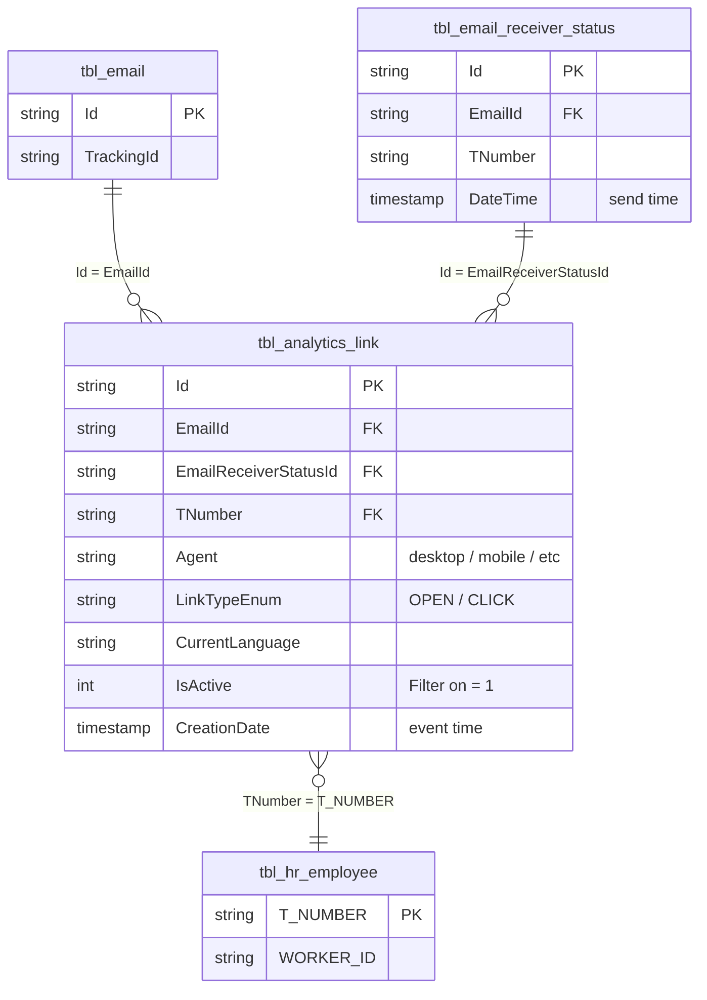

# `imep_bronze.tbl_analytics_link`

> **Open & Click events** per recipient × link × interaction. One row per event. **Largest Bronze table in the project** (533M rows) and the only iMEP table with a **truly incremental** write pattern (3.7–8.5k rows per MERGE cycle). Together with `tbl_email_receiver_status`, one of the two full-key fact hubs.

| | |
|---|---|
| **Layer** | Bronze |
| **Source system** | iMEP (SQL Server) → Change Data Capture (CDC) → Delta Bronze |
| **Grain** | 1 row per event (Open or Click) per recipient × mailing × link |
| **Primary key** | `Id` |
| **FK** | `EmailId` → `tbl_email.Id`; `EmailReceiverStatusId` → `tbl_email_receiver_status.Id`; `TNumber` → `tbl_hr_employee.T_NUMBER` |
| **Write pattern** | MERGE **incremental** (Service Principal) |
| **Approx row count** | **533M** (as of 2026-04-20, timespan Nov 2020 – Apr 2026) |
| **Per-MERGE delta** | **3.7–8.5K rows** (truly incremental — only new click events) |

---

## Neighborhood — direct joins with keys



---

## Key Columns

| Column | Type | Role | Notes |
|---|---|---|---|
| `Id` | string | **PK** | GUID, unique per event |
| `EmailId` | string | **FK** → `tbl_email.Id` | Mailing reference |
| `EmailReceiverStatusId` | string | **FK** → `tbl_email_receiver_status.Id` | Bridge to the send event (→ TNumber, receiver) |
| `TNumber` | string | **FK** → `tbl_hr_employee.T_NUMBER` | Lowercase, redundant with the receiver-status table |
| `Agent` | string | Device/Client | e.g. `desktop`, `mobile`, mail-client string |
| `LinkTypeEnum` | string | **Event type** | `OPEN` (mail opened) or `CLICK` (link clicked) |
| `CurrentLanguage` | string | Localization | `DE`/`EN`/… |
| `IsActive` | int | Soft-delete flag | **Always filter `WHERE IsActive = 1`** |
| `CreationDate` | timestamp | **Event time** | When the Open/Click happened |

Further 13 columns (see schema check — 22 columns in total). Geo info, IP hash etc.

---

## Sample row

```
Id                      = "7d2f4a91-..."
EmailId                 = "0a3f6c2e-..."
EmailReceiverStatusId   = "3b9c1a8f-..."
TNumber                 = "t100200"
Agent                   = "Desktop Outlook"
LinkTypeEnum            = "CLICK"
CurrentLanguage         = "DE"
IsActive                = 1
CreationDate            = 2024-07-09 09:34:12
```

---

## Primary joins

### → Pattern A: Open/Click funnel per mailing

```sql
SELECT e.TrackingId,
       COUNT(DISTINCT CASE WHEN al.LinkTypeEnum = 'OPEN'  THEN al.TNumber END) AS unique_opens,
       COUNT(DISTINCT CASE WHEN al.LinkTypeEnum = 'CLICK' THEN al.TNumber END) AS unique_clicks,
       COUNT(CASE WHEN al.LinkTypeEnum = 'CLICK' THEN 1 END)                   AS total_clicks
FROM   imep_bronze.tbl_email            e
JOIN   imep_bronze.tbl_analytics_link   al ON al.EmailId = e.Id
WHERE  al.IsActive = 1
  AND  e.TrackingId IS NOT NULL
GROUP BY e.TrackingId
```

### → Pattern B: Send-to-event tracing

```sql
SELECT rs.TNumber, rs.DateTime AS send_time, al.LinkTypeEnum, al.CreationDate AS event_time,
       DATEDIFF(second, rs.DateTime, al.CreationDate) AS seconds_to_event
FROM   imep_bronze.tbl_email_receiver_status rs
JOIN   imep_bronze.tbl_analytics_link         al ON al.EmailReceiverStatusId = rs.Id
                                                AND al.EmailId               = rs.EmailId
WHERE  al.IsActive = 1
```

### → Pattern C: Device/Agent breakdown

```sql
SELECT al.Agent, COUNT(*) AS events
FROM   imep_bronze.tbl_analytics_link al
WHERE  al.IsActive = 1
  AND  al.CreationDate >= '2025-01-01'
GROUP BY al.Agent
ORDER BY events DESC
```

---

## Quality caveats

- **Largest table in the project — 533M rows.** Queries **must always** be time-constrained (`WHERE CreationDate >= …`) or filtered by `EmailId`/`TrackingId`. Full scan = timeout risk.
- **Always apply `IsActive = 1`** — otherwise soft-deleted events slip into the numbers.
- **Truly incremental**: Only 3.7–8.5k new rows per 12h cycle. This means backfill anomalies are unlikely, but Delta history is huge (110+ write operations for Bronze alone).
- **`LinkTypeEnum` values**: Only `OPEN` and `CLICK` are reliable. Any other values (if present) must be validated first.
- **`TNumber` redundant** with `tbl_email_receiver_status.TNumber` — when joining both tables you can drop one of the columns.
- **Agent values are a free-form string** — no canonical enum list. For device analytics, define a mapping logic first (desktop/mobile/tablet).

---

## Lineage — Bronze → Gold

> Skips Silver. One of the three Bronze inputs for `imep_gold.final`.

```
imep_bronze.tbl_analytics_link  ────┐
imep_bronze.tbl_email_receiver_status  ┼──► imep_gold.final (~520M rows,
imep_bronze.tbl_email                  ┘                    Full Rebuild)
```

Events also feed the Tier-3 aggregates (`tbl_pbi_kpi` pivot: OpenCount/ClickCount, `_region`, `_division`) via `GROUP BY MailingId × Dimension`.

---

## Incrementality anomaly — why this matters

`tbl_analytics_link` is the **only** iMEP Bronze table with a truly incremental MERGE. Implications:

- Total size grows only through new events — no re-ingestion of old data
- **Delta history stays interpretable** (each entry = one real mini-batch)
- For streaming-style dashboards (live click-through rate) this is the best available source

Still not true streaming — batches are buffered 12h.

---

## References

- ER diagram Section 2: [../../architecture_diagram.md](../../architecture_diagram.md)
- Join Strategy Contract: [../../joins/join_strategy_contract.md](../../joins/join_strategy_contract.md)
- Canonical Bronze join chain: [../../joins/imep_bronze_email_events.md](../../joins/imep_bronze_email_events.md) *(pending)*
- Genie findings: `memory/imep_join_graph_q27_findings.md`, `memory/imep_pipeline_ops_q28_findings.md`

---

## Sources

Genie sessions backing the statements on this page: [Q2](../../sources.md#q2), [Q26](../../sources.md#q26), [Q27](../../sources.md#q27), [Q28](../../sources.md#q28). See [sources.md](../../sources.md) for the full index.
