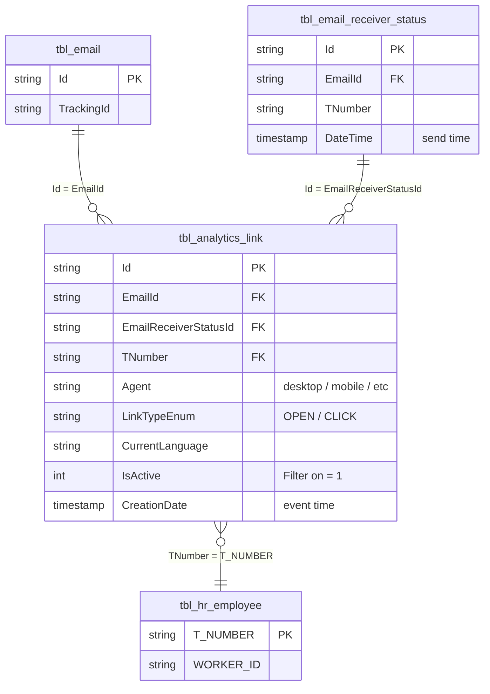

# `imep_bronze.tbl_analytics_link`

> **Open & Click Events** pro Empfänger × Link × Interaktion. Eine Row pro Event. **Grösste Bronze-Tabelle im Projekt** (533M Rows) und einzige iMEP-Tabelle mit **echt inkrementellem** Write-Pattern (3.7–8.5k Rows pro MERGE-Zyklus). Zusammen mit `tbl_email_receiver_status` einer der beiden Full-Key-Fact-Hubs.

| | |
|---|---|
| **Layer** | Bronze |
| **Source system** | iMEP (SQL Server) → CDC → Delta |
| **Grain** | 1 row per Event (Open oder Click) pro Empfänger × Mailing × Link |
| **Primary key** | `Id` |
| **FK** | `EmailId` → `tbl_email.Id`; `EmailReceiverStatusId` → `tbl_email_receiver_status.Id`; `TNumber` → `tbl_hr_employee.T_NUMBER` |
| **Refresh** | **2×/Tag @ 00:00 und 12:00 UTC** (MERGE **inkrementell**, Service Principal) — Q28 |
| **Approx row count** | **533M** (Q27-Stand 2026-04-20, Timespan Nov 2020 – Apr 2026) |
| **Per-MERGE delta** | **3.7–8.5K rows** (echt inkrementell — nur neue Click-Events) |
| **PII** | `TNumber` → indirekt identifizierend |

---

## Neighborhood — direkte Joins mit Keys



---

## Key Columns

| Column | Type | Role | Notes |
|---|---|---|---|
| `Id` | string | **PK** | GUID, eindeutig pro Event |
| `EmailId` | string | **FK** → `tbl_email.Id` | Mailing-Referenz |
| `EmailReceiverStatusId` | string | **FK** → `tbl_email_receiver_status.Id` | Bridge zum Send-Event (→ TNumber, Receiver) |
| `TNumber` | string | **FK** → `tbl_hr_employee.T_NUMBER` | Lowercase, doppelt zur Receiver-Status-Tabelle |
| `Agent` | string | Device/Client | z.B. `desktop`, `mobile`, Mail-Client-String |
| `LinkTypeEnum` | string | **Event-Type** | `OPEN` (Mail geöffnet) oder `CLICK` (Link angeklickt) |
| `CurrentLanguage` | string | Localization | `DE`/`EN`/… |
| `IsActive` | int | Soft-Delete-Flag | **Immer `WHERE IsActive = 1`** filtern |
| `CreationDate` | timestamp | **Event time** | Wann ist Open/Click passiert |

Weitere 13 Spalten (siehe Q2-Schema-Check — insgesamt 22 Spalten). Geo-Info, IP-Hash etc.

---

## Sample row

```
Id                      = "7d2f4a91-..."
EmailId                 = "0a3f6c2e-..."
EmailReceiverStatusId   = "3b9c1a8f-..."
TNumber                 = "t100200"
Agent                   = "Desktop Outlook"
LinkTypeEnum            = "CLICK"
CurrentLanguage         = "DE"
IsActive                = 1
CreationDate            = 2024-07-09 09:34:12
```

---

## Primary joins

### → Pattern A: Open/Click-Funnel pro Mailing

```sql
SELECT e.TrackingId,
       COUNT(DISTINCT CASE WHEN al.LinkTypeEnum = 'OPEN'  THEN al.TNumber END) AS unique_opens,
       COUNT(DISTINCT CASE WHEN al.LinkTypeEnum = 'CLICK' THEN al.TNumber END) AS unique_clicks,
       COUNT(CASE WHEN al.LinkTypeEnum = 'CLICK' THEN 1 END)                   AS total_clicks
FROM   imep_bronze.tbl_email            e
JOIN   imep_bronze.tbl_analytics_link   al ON al.EmailId = e.Id
WHERE  al.IsActive = 1
  AND  e.TrackingId IS NOT NULL
GROUP BY e.TrackingId
```

### → Pattern B: Send-to-Event-Tracing

```sql
SELECT rs.TNumber, rs.DateTime AS send_time, al.LinkTypeEnum, al.CreationDate AS event_time,
       DATEDIFF(second, rs.DateTime, al.CreationDate) AS seconds_to_event
FROM   imep_bronze.tbl_email_receiver_status rs
JOIN   imep_bronze.tbl_analytics_link         al ON al.EmailReceiverStatusId = rs.Id
                                                AND al.EmailId               = rs.EmailId
WHERE  al.IsActive = 1
```

### → Pattern C: Device/Agent-Breakdown

```sql
SELECT al.Agent, COUNT(*) AS events
FROM   imep_bronze.tbl_analytics_link al
WHERE  al.IsActive = 1
  AND  al.CreationDate >= '2025-01-01'
GROUP BY al.Agent
ORDER BY events DESC
```

---

## Quality caveats

- **Grösste Tabelle im Projekt — 533M Rows.** Queries **immer** zeitlich einschränken (`WHERE CreationDate >= …`) oder per `EmailId`/`TrackingId` filtern. Full-Scan = Timeout-Risiko.
- **`IsActive = 1` IMMER setzen** — sonst mischen sich Soft-Deleted-Events in die Zahlen.
- **Echt inkrementell**: Pro 12h-Zyklus nur 3.7–8.5k neue Rows. Das heisst: Backfill-Anomalien sind unwahrscheinlich, Delta-History ist aber riesig (110+ Write-Operations alleine für Bronze laut Q28).
- **`LinkTypeEnum`-Werte**: Nur `OPEN` und `CLICK` sind verlässlich. Andere Werte (falls vorhanden) zuerst validieren.
- **`TNumber` redundant** zu `tbl_email_receiver_status.TNumber` — bei Joins auf beide Tabellen kann man eine der Spalten droppen.
- **Agent-Werte sind freier String** — keine kanonische Enum-Liste. Für Device-Analytics erst Mapping-Logic definieren (desktop/mobile/tablet).

---

## Lineage — Bronze → Gold

> Skippt Silver (Q26). Einer der drei Bronze-Inputs für `imep_gold.final`.

```
imep_bronze.tbl_analytics_link  ────┐
imep_bronze.tbl_email_receiver_status  ┼──► imep_gold.final (~520M rows,
imep_bronze.tbl_email                  ┘                    CTAS 2×/day)
```

Events werden auch in die Tier-3-Aggregate (`tbl_pbi_kpi` pivot: OpenCount/ClickCount, `_region`, `_division`) per `GROUP BY MailingId × Dimension` aggregiert.

---

## Inkrementalitäts-Anomalie — why this matters

`tbl_analytics_link` ist die **einzige** iMEP-Bronze-Tabelle mit echtem Incremental-MERGE (Q28). Das hat Implikationen:

- Gesamtgrösse wächst nur durch neue Events — keine Re-Ingestion alter Daten
- **Delta-History bleibt interpretierbar** (jeder Eintrag = eine echte Mini-Batch)
- Für Streaming-artige Dashboards (Live-Click-Through-Rate) ist das die beste verfügbare Quelle

Trotzdem kein echtes Streaming — Batches sind 12h-gepuffert.

---

## Referenzen

- ER-Diagramm Section 2: [../../architecture_diagram.md](../../architecture_diagram.md)
- Join Strategy Contract: [../../joins/join_strategy_contract.md](../../joins/join_strategy_contract.md)
- Canonical Bronze-Join-Kette: [../../joins/imep_bronze_email_events.md](../../joins/imep_bronze_email_events.md) *(pending)*
- Genie-Findings: `memory/imep_join_graph_q27_findings.md`, `memory/imep_pipeline_ops_q28_findings.md`
