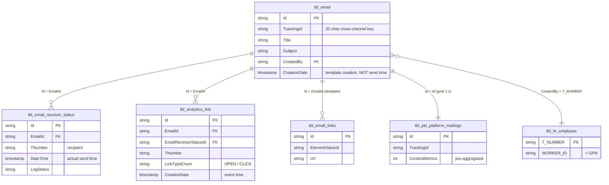

# `imep_bronze.tbl_email`

> Master-Tabelle für iMEP-Mailings. Einziger Ort in Bronze, an dem `TrackingId` direkt am Mailing hängt — alles andere (Sends, Opens, Clicks) verknüpft sich über `EmailId = Id` zurück an diese Zeile.

| | |
|---|---|
| **Layer** | Bronze |
| **Source system** | iMEP (SQL Server) → CDC → Delta |
| **Grain** | 1 row per Mailing (Versand-Definition, nicht pro Empfänger) |
| **Primary key** | `Id` |
| **Cross-channel key** | `TrackingId` (32-char, 5 Segmente) |
| **Refresh** | *TBD — via Q28 (`DESCRIBE HISTORY`) zu klären* |
| **Approx row count** | ~145K (Q27-Stand 2026-04-20, Timespan Nov 2020 – Apr 2026) |
| **PII** | `CreatedBy` = TNumber des Autors → indirekt identifizierend |

---

## Neighborhood — direkte Joins mit Keys



---

## Key Columns

| Column | Type | Role | Notes |
|---|---|---|---|
| `Id` | string | **PK** | GUID, Join-Target für alle iMEP-Children |
| `TrackingId` | string | **Cross-channel join** | `CLUSTER-PACK-YYMMDD-ACTIVITY-CHANNEL`. UPPER & clean. Genau 32 Zeichen wenn populated, sonst NULL bei nicht-getrackten Mailings. |
| `Title` | string | Description | Interner Name, kein Subject |
| `Subject` | string | Description | E-Mail-Betreff (sichtbar für Empfänger) |
| `CreatedBy` | string | FK → `tbl_hr_employee.T_NUMBER` | TNumber lowercase (`t100200`), **nicht** GPN |
| `CreationDate` | timestamp | Temporal | Erstellzeit des Mailing-Templates — **nicht** Versandzeit (die steckt in `tbl_email_receiver_status.DateTime`) |

Vollständige Spaltenliste: `DESCRIBE imep_bronze.tbl_email` in Databricks.

---

## Sample row

```
Id            = "0a3f6c2e-..."
TrackingId    = "QRREP-0000058-240709-0000060-EMI"
Title         = "Q2 Investor Update — DE"
Subject       = "Ihr Quartalsbericht zum Q2 2024"
CreatedBy     = "t100200"
CreationDate  = 2024-07-08 14:22:31
```

---

## Primary joins

### → `tbl_email_receiver_status` (1:N) — Sends / Bounces
Eine Mailing-Zeile, viele Empfänger. Hier lebt **wer hat es bekommen** und **wann versendet**.

```sql
SELECT e.TrackingId, rs.TNumber, rs.DateTime, rs.LogStatus
FROM   imep_bronze.tbl_email e
JOIN   imep_bronze.tbl_email_receiver_status rs ON rs.EmailId = e.Id
WHERE  e.TrackingId IS NOT NULL
```

### → `tbl_analytics_link` (1:N) — Opens / Clicks
Interaktions-Events (OPEN, CLICK). Jede Row = ein Event eines Empfängers.

```sql
SELECT e.TrackingId, al.TNumber, al.LinkTypeEnum, al.CreationDate AS event_time, al.Agent
FROM   imep_bronze.tbl_email e
JOIN   imep_bronze.tbl_analytics_link al ON al.EmailId = e.Id
WHERE  al.IsActive = 1
```

### → `tbl_email_links` (1:N) — Template-URL-Inventory
Statische URLs im Template. Nicht für Funnel-Metriken — dafür `tbl_analytics_link` nehmen.

### → `imep_gold.tbl_pbi_platform_mailings` (1:1) — Pre-aggregated Master
Gleiche `Id`, aber mit Content-Metriken angereichert. **Wir konsumieren Gold**, nicht Bronze (siehe Lineage unten).

---

## Quality caveats

- **TrackingId NULL-Rate**: Nicht jedes Mailing ist getrackt. Für Cross-Channel-Attribution `WHERE TrackingId IS NOT NULL` setzen. Q24: nur 986/73,930 Mailings (1.3%) haben TrackingId, aber starker Uptrend (2024: 99 → 2025: 637 → 2026 YTD: 250).
- **TrackingId-Format**: Immer 32 Zeichen, 5 Segmente getrennt durch `-`, UPPER. Channel-Segment (SEG5) ist System-Ownership, nicht Medium — für Cross-Channel-Match mit SharePoint nur SEG1–4 vergleichen (siehe `joins/cross_channel_trackingid.md`).
- **Cross-Channel-Pfad (Q27)**: TrackingId ist **Dimension**, nicht Fact-Key — koexistiert **nie** mit EmailId in derselben Tabelle. Cross-Channel läuft deshalb `tbl_email.TrackingId ↔ sharepoint_bronze.pages.UBSGICTrackingID`, **nicht** über Engagement-Rows (`pageviews` / `tbl_analytics_link`).
- **`CreationDate` ≠ Versandzeit**: Für "wann ging's raus" `tbl_email_receiver_status.DateTime` joinen.
- **`CreatedBy` Format**: lowercase `t######`. Joins gegen `tbl_hr_user.UbsId` brauchen `LOWER(UbsId)`.

---

## Lineage — Bronze → Gold (Silver ist übersprungen!)

> **Confirmed 2026-04-20 (Q26)**: Email-Engagement **skipped den Silver-Layer komplett**. iMEP hat sich bewusst gegen eine dedizierte `silver.fact_email`-Schicht entschieden. `imep_silver` existiert — aber nur für **Events** (`invitation`, `eventregistration`, `event`), nicht für Email.

```
imep_bronze.tbl_email
imep_bronze.tbl_email_receiver_status   ───►   imep_gold.final  (~520M rows)
imep_bronze.tbl_analytics_link                    │
                                                  ├─ denormalisierter Join über Bronze
                                                  ├─ HR-Enrichment spät angewendet
                                                  └─ extreme Breite & Grösse by design

imep_bronze.tbl_email  ───►  imep_gold.tbl_pbi_platform_mailings  [Master, 1:1 zu Bronze.Id]
                                       │
                                       └─► imep_gold.<tier-3 engagement>
                                              - Join über lowercase `mailingid`
                                              - UniqueOpens / UniqueClicks pro Mailing × Region
```

**Consumption-Strategie für Cross-Channel-MVP**:
- **Email-Events**: aus `imep_gold.final` konsumieren (ist *der* Email-Fact), nicht Bronze neu joinen.
- **Mailing-Master**: `imep_gold.tbl_pbi_platform_mailings` für Title/Subject/TrackingId pro Mailing.
- **Engagement-KPIs**: Tier-3 Tabellen (`UniqueOpens`/`UniqueClicks` pro Mailing × Region/Division).

**Offen (Q28/Q29/Q30)**:
- Exakter Tabellenname `imep_gold.final` + Spalten-Grain (per-recipient-event?)
- Refresh-Cadence via `DESCRIBE HISTORY`
- Ob `imep_gold.final` alle Bronze-Spalten 1:1 trägt oder nur KPI-Untermenge

Siehe [memory/imep_silver_q26_findings.md](../../../../.claude/projects/-Users-micha-Documents-Arbeit-Databricks/memory/imep_silver_q26_findings.md) für volle Findings.

---

## Referenzen

- ER-Diagramm: Section 2 in [../../architecture_diagram.md](../../architecture_diagram.md)
- Canonical Join-Kette: [../../joins/imep_bronze_join.md](../../joins/imep_bronze_join.md) *(tbd)*
- Cross-Channel TrackingId-Match: [../../joins/cross_channel_trackingid.md](../../joins/cross_channel_trackingid.md) *(tbd)*
- Genie-Findings: `memory/imep_genie_findings_q1_q2_q3.md`
