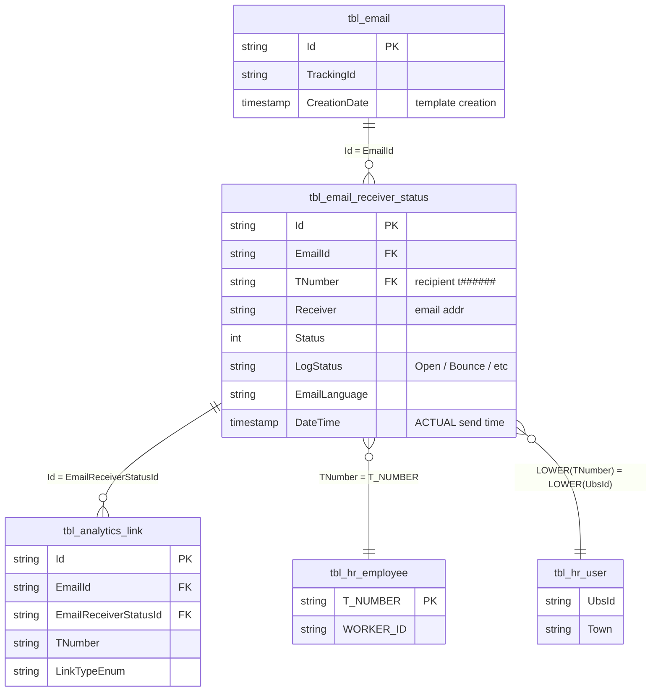

# `imep_bronze.tbl_email_receiver_status`

> **Sends & Bounces** pro Empfänger. Eine Row pro Mailing × Empfänger. Zusammen mit `tbl_analytics_link` einer der beiden **Full-Key-Fact-Hubs** (Id + EmailId + TNumber). Hier steht auch die **echte Versandzeit** (`DateTime`), nicht die Template-Erstellzeit.

| | |
|---|---|
| **Layer** | Bronze |
| **Source system** | iMEP (SQL Server) → CDC → Delta |
| **Grain** | 1 row per Mailing × Empfänger (pro Send-Event) |
| **Primary key** | `Id` |
| **FK** | `EmailId` → `tbl_email.Id`; `TNumber` → `tbl_hr_employee.T_NUMBER` |
| **Refresh** | **2×/Tag @ 00:00 und 12:00 UTC** (MERGE Full-Table Upsert, Service Principal) — Q28 |
| **Approx row count** | **293M** (Q27-Stand 2026-04-20, Timespan Nov 2020 – Apr 2026) |
| **Per-MERGE delta** | 27–72M rows (full-replace upsert) |
| **PII** | `TNumber` + `Receiver` (Email-Adresse) → direkt identifizierend |

---

## Neighborhood — direkte Joins mit Keys



---

## Key Columns

| Column | Type | Role | Notes |
|---|---|---|---|
| `Id` | string | **PK** | GUID. Wird in `tbl_analytics_link.EmailReceiverStatusId` referenziert → der Bridge von Send-Event zu Open/Click-Event. |
| `EmailId` | string | **FK** → `tbl_email.Id` | Verbindet zum Mailing-Master |
| `TNumber` | string | **FK** → `tbl_hr_employee.T_NUMBER` | Lowercase `t######`. **Der einzige Person-Key**, den iMEP pro Empfänger führt. |
| `Receiver` | string | PII | Email-Adresse, nur bei PII-Bedarf ziehen |
| `Status` | int | Status-Code | Numerisch — Mapping über `LogStatus` lesbarer |
| `LogStatus` | string | **Human-readable** | Werte wie `Open`, `Bounce`, `Sent`, etc. Für Filter/Grouping nutzen. |
| `EmailLanguage` | string | Localization | `DE`/`EN`/`FR`/… |
| `DateTime` | timestamp | **Actual send time** | Die **echte** Versandzeit — **nicht** `tbl_email.CreationDate` nutzen! |

Vollständige Spaltenliste: `DESCRIBE imep_bronze.tbl_email_receiver_status` (vom Q2-Schema-Check waren es die Standard-Metadaten ohne Spezialspalten).

---

## Sample row

```
Id             = "3b9c1a8f-..."
EmailId        = "0a3f6c2e-..."           -- join zu tbl_email.Id
TNumber        = "t100200"
Receiver       = "max.muster@example.com"
Status         = 1
LogStatus      = "Open"
EmailLanguage  = "DE"
DateTime       = 2024-07-09 08:12:47      -- actual send time
```

---

## Primary joins

### → `tbl_email` (N:1) — Mailing-Master mit TrackingId

```sql
SELECT rs.*, e.TrackingId, e.Title, e.Subject
FROM   imep_bronze.tbl_email_receiver_status rs
JOIN   imep_bronze.tbl_email                  e ON e.Id = rs.EmailId
```

### → `tbl_analytics_link` (1:N) — Open / Click Events

```sql
SELECT rs.TNumber, rs.DateTime AS send_time, al.LinkTypeEnum, al.CreationDate AS event_time, al.Agent
FROM   imep_bronze.tbl_email_receiver_status rs
JOIN   imep_bronze.tbl_analytics_link         al ON al.EmailReceiverStatusId = rs.Id
                                                AND al.EmailId               = rs.EmailId
WHERE  al.IsActive = 1
```

### → `tbl_hr_employee` (N:1) — HR-Enrichment (Region/Division)

```sql
SELECT rs.*, hr.WORKER_ID AS gpn, hr.ORGANIZATIONAL_UNIT
FROM   imep_bronze.tbl_email_receiver_status rs
LEFT JOIN imep_bronze.tbl_hr_employee          hr ON hr.T_NUMBER = rs.TNumber
```

---

## Quality caveats

- **Granularität**: 1 Row pro Empfänger × Mailing. Bei grossem Mailing × vielen Empfängern schnell 100k+ Rows pro Mailing.
- **Full-Table-MERGE**: Jede 12h wird die gesamte Tabelle upserted (27-72M pro Run) — nicht inkrementell. Bedeutet: Delta-History zeigt eine "Welle" pro Refresh-Zyklus, kein Streaming.
- **`LogStatus` vs `Status`**: `LogStatus` ist der lesbare String (`Open`, `Bounce`, …), `Status` der numerische Code. Für Dashboards **immer `LogStatus`** nutzen.
- **`DateTime` ist Versandzeit** — für "wann wurde geöffnet" musst du in `tbl_analytics_link.CreationDate` schauen.
- **PII**: `Receiver` ist eine Klartext-Email-Adresse. Nur ziehen, wenn explizit benötigt; sonst nur `TNumber` nutzen.

---

## Lineage — Bronze → Gold

> Email-Engagement **skippt Silver** (Q26). `tbl_email_receiver_status` ist eine der drei Bronze-Quellen, die direkt in `imep_gold.final` einfliessen.

```
imep_bronze.tbl_email                    ┐
imep_bronze.tbl_email_receiver_status    ├──► imep_gold.final  (~520M rows,
imep_bronze.tbl_analytics_link           ┘                    denormalisiert, HR-enriched)
```

Auch in die Tier-3-Aggregate (`tbl_pbi_mailings_region`, `_division`, `tbl_pbi_kpi`) fliessen Send-Counts aus dieser Tabelle, aggregiert per `GROUP BY MailingId × Dimension`.

---

## Referenzen

- ER-Diagramm Section 2: [../../architecture_diagram.md](../../architecture_diagram.md)
- Canonical Bronze-Join-Kette: [../../joins/imep_bronze_email_events.md](../../joins/imep_bronze_email_events.md) *(pending)*
- Join Strategy Contract: [../../joins/join_strategy_contract.md](../../joins/join_strategy_contract.md)
- Genie-Findings: `memory/imep_genie_findings_q1_q2_q3.md`, `memory/imep_join_graph_q27_findings.md`, `memory/imep_pipeline_ops_q28_findings.md`
