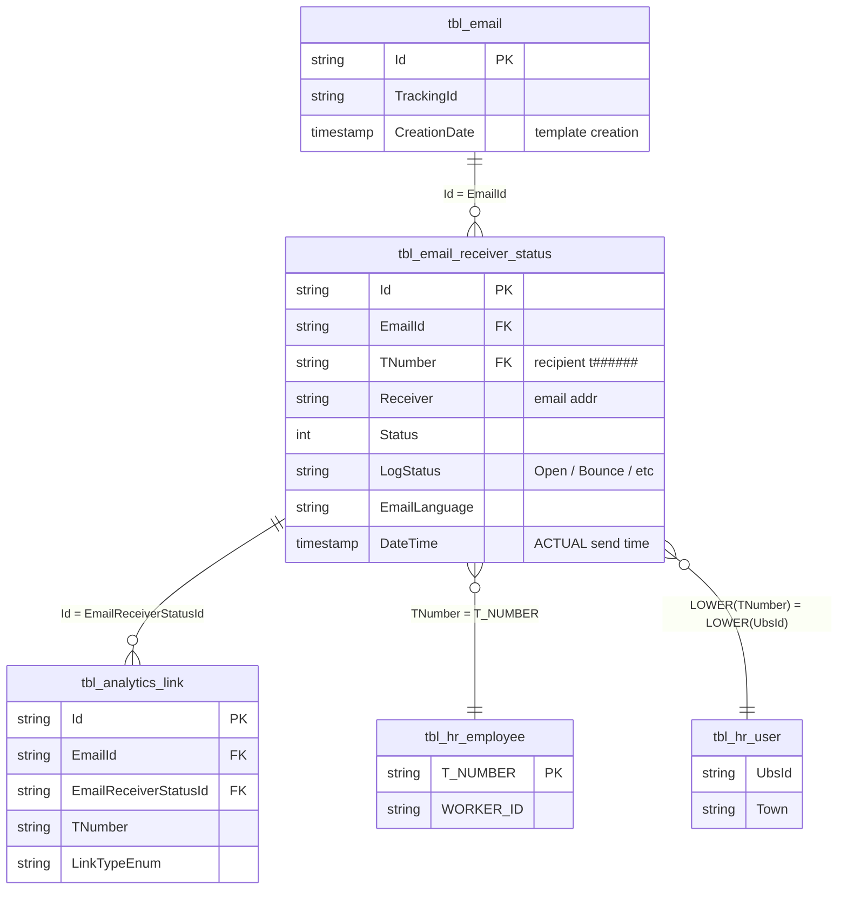

# `imep_bronze.tbl_email_receiver_status`

> **Sends & Bounces** per recipient. One row per mailing × recipient. Together with `tbl_analytics_link`, one of the two **full-key fact hubs** (Id + EmailId + TNumber). This is also where the **actual send time** (`DateTime`) lives, not the template creation time.

| | |
|---|---|
| **Layer** | Bronze |
| **Source system** | iMEP (SQL Server) → Change Data Capture (CDC) → Delta Bronze |
| **Grain** | 1 row per mailing × recipient (per send event) |
| **Primary key** | `Id` |
| **FK** | `EmailId` → `tbl_email.Id`; `TNumber` → `tbl_hr_employee.T_NUMBER` |
| **Write pattern** | MERGE full-table upsert (Service Principal) |
| **Approx row count** | **293M** (as of 2026-04-20, timespan Nov 2020 – Apr 2026) |
| **Per-MERGE delta** | 27–72M rows (full-replace upsert) |

---

## Neighborhood — direct joins with keys



---

## Key Columns

| Column | Type | Role | Notes |
|---|---|---|---|
| `Id` | string | **PK** | GUID. Referenced in `tbl_analytics_link.EmailReceiverStatusId` → the bridge from send event to Open/Click event. |
| `EmailId` | string | **FK** → `tbl_email.Id` | Connects to the mailing master |
| `TNumber` | string | **FK** → `tbl_hr_employee.T_NUMBER` | Lowercase `t######`. **The only person key** iMEP carries per recipient. |
| `Status` | int | Status code | Numeric — mapping via `LogStatus` is more readable |
| `LogStatus` | string | **Human-readable** | Values like `Open`, `Bounce`, `Sent`, etc. Use for filtering/grouping. |
| `EmailLanguage` | string | Localization | `DE`/`EN`/`FR`/… |
| `DateTime` | timestamp | **Actual send time** | The **real** send time — **do not use** `tbl_email.CreationDate`! |

Full column list: `DESCRIBE imep_bronze.tbl_email_receiver_status` (the schema check returned standard metadata with no special columns).

---

## Sample row

```
Id             = "3b9c1a8f-..."
EmailId        = "0a3f6c2e-..."           -- join to tbl_email.Id
TNumber        = "t100200"
Status         = 1
LogStatus      = "Open"
EmailLanguage  = "DE"
DateTime       = 2024-07-09 08:12:47      -- actual send time
```

---

## Primary joins

### → `tbl_email` (N:1) — Mailing master with TrackingId

```sql
SELECT rs.*, e.TrackingId, e.Title, e.Subject
FROM   imep_bronze.tbl_email_receiver_status rs
JOIN   imep_bronze.tbl_email                  e ON e.Id = rs.EmailId
```

### → `tbl_analytics_link` (1:N) — Open / Click events

```sql
SELECT rs.TNumber, rs.DateTime AS send_time, al.LinkTypeEnum, al.CreationDate AS event_time, al.Agent
FROM   imep_bronze.tbl_email_receiver_status rs
JOIN   imep_bronze.tbl_analytics_link         al ON al.EmailReceiverStatusId = rs.Id
                                                AND al.EmailId               = rs.EmailId
WHERE  al.IsActive = 1
```

### → `tbl_hr_employee` (N:1) — HR enrichment (Region/Division)

```sql
SELECT rs.*, hr.WORKER_ID AS gpn, hr.ORGANIZATIONAL_UNIT
FROM   imep_bronze.tbl_email_receiver_status rs
LEFT JOIN imep_bronze.tbl_hr_employee          hr ON hr.T_NUMBER = rs.TNumber
```

---

## Quality caveats

- **Granularity**: 1 row per recipient × mailing. Large mailing × many recipients can quickly yield 100k+ rows per mailing.
- **Full-table MERGE**: The whole table is upserted (27-72M per run) — not incremental. Delta history shows one "wave" per run, not a stream.
- **`LogStatus` vs `Status`**: `LogStatus` is the readable string (`Open`, `Bounce`, …), `Status` is the numeric code. For dashboards **always use `LogStatus`**.
- **`DateTime` is send time** — for "when was it opened" check `tbl_analytics_link.CreationDate`.

---

## Lineage — Bronze → Gold

> Email engagement **skips Silver**. `tbl_email_receiver_status` is one of the three Bronze sources feeding directly into `imep_gold.final`.

```
imep_bronze.tbl_email                    ┐
imep_bronze.tbl_email_receiver_status    ├──► imep_gold.final  (~520M rows,
imep_bronze.tbl_analytics_link           ┘                    denormalized, HR-enriched)
```

Send counts from this table also feed the Tier-3 aggregates (`tbl_pbi_mailings_region`, `_division`, `tbl_pbi_kpi`), aggregated via `GROUP BY MailingId × Dimension`.

---

## References

- ER diagram Section 2: [../../architecture_diagram.md](../../architecture_diagram.md)
- Canonical Bronze join chain: [../../joins/imep_bronze_email_events.md](../../joins/imep_bronze_email_events.md) *(pending)*
- Join Strategy Contract: [../../joins/join_strategy_contract.md](../../joins/join_strategy_contract.md)
- Genie findings: `memory/imep_genie_findings_q1_q2_q3.md`, `memory/imep_join_graph_q27_findings.md`, `memory/imep_pipeline_ops_q28_findings.md`

---

## Sources

Genie sessions backing the statements on this page: [Q2](../../sources.md#q2), [Q26](../../sources.md#q26), [Q27](../../sources.md#q27), [Q28](../../sources.md#q28). See [sources.md](../../sources.md) for the full index.
