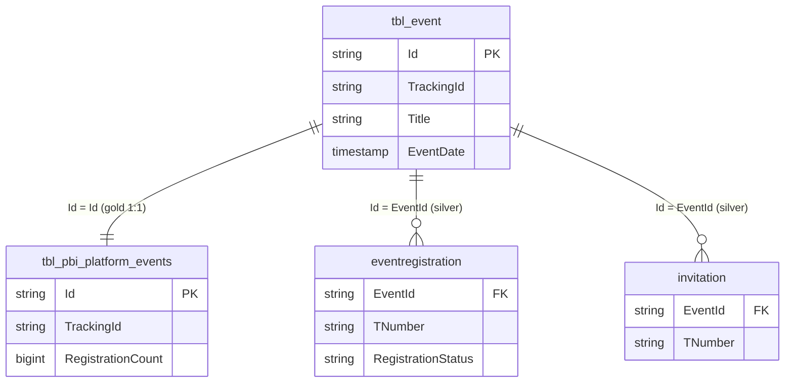

# `imep_bronze.tbl_event`

> **Event master table** — Events as a feature in iMEP (not to be confused with "email events" in the sense of Opens/Clicks). Carries **`TrackingId`** (one of only 4 tables with this column). For event registrations see also `imep_silver.eventregistration` (13.7M).

| | |
|---|---|
| **Layer** | Bronze |
| **Source system** | iMEP (SQL Server) → Change Data Capture (CDC) → Delta Bronze |
| **Grain** | 1 row per event definition |
| **Primary key** | `Id` |
| **Cross-channel key** | `TrackingId` |
| **Write pattern** | MERGE |
| **Approx row count** | ~100K (timespan 2009 – Apr 2026 — oldest dataset in the project!) |

---

## Key Columns (expected — exact verification via `DESCRIBE`)

| Column | Type | Role | Notes |
|---|---|---|---|
| `Id` | string | **PK** | Event GUID |
| `TrackingId` | string | **Cross-channel key** | Format like `tbl_email.TrackingId`, 32-char 5-seg |
| `Title` | string | | Event name |
| `EventDate` | timestamp | | When the event takes place |
| `CreatedBy` | string | | TNumber of the creator |
| `CreationDate` | timestamp | | When the event was created |

Full schema: `DESCRIBE imep_bronze.tbl_event`.

---

## Relationships



---

## Primary joins

### → `imep_silver.eventregistration` — Who registered?

```sql
SELECT e.Title, e.EventDate, e.TrackingId, er.TNumber, er.RegistrationStatus
FROM   imep_bronze.tbl_event           e
JOIN   imep_silver.eventregistration   er ON er.EventId = e.Id
WHERE  e.TrackingId IS NOT NULL
  AND  e.EventDate >= '2025-01-01'
```

### → `imep_gold.tbl_pbi_platform_events` — Pre-aggregated with registration count

```sql
SELECT e.Title, e.TrackingId, pe.RegistrationCount
FROM   imep_bronze.tbl_event                 e
JOIN   imep_gold.tbl_pbi_platform_events     pe ON pe.Id = e.Id
```

→ For dashboard consumption: use Gold instead of Bronze → Silver aggregation.

---

## Quality caveats

- **`EventDate` can be 2124 (sentinel for "open-ended")** confirmed. When filtering, guard with `WHERE EventDate < '2100-01-01'` if required.
- **Oldest dataset in the project** (from 2009 onward). Pre-2020 data has limited relevance for cross-channel analyses, but historical events exist.
- **TrackingId adoption**: Most pre-2024 events have no TrackingId — cross-channel attribution is only possible for more recent events.

---

## Lineage

```
imep_bronze.tbl_event
        │
        ├──► imep_silver.event (84K), invitation, eventregistration (13.7M)  [Silver exists for events!]
        │
        └──► imep_gold.tbl_pbi_platform_events (84K) with RegistrationCount
```

**Important**: Events are **the one area** where `imep_silver` exists. Email engagement **does not**.

---

## References

- `eventregistration.md` *(Silver card pending)*
- [tbl_email.md](tbl_email.md) — Parallel structure for mailings
- [er_imep_bronze.md](../../diagrams/er_imep_bronze.md)
- [cross_channel_via_tracking_id.md](../../joins/cross_channel_via_tracking_id.md) — TrackingId match rule applies to events as well

---

## Sources

Genie sessions backing the statements on this page: [Q1b](../../sources.md#q1b), [Q26](../../sources.md#q26), [Q27](../../sources.md#q27). See [sources.md](../../sources.md) for the full index.
