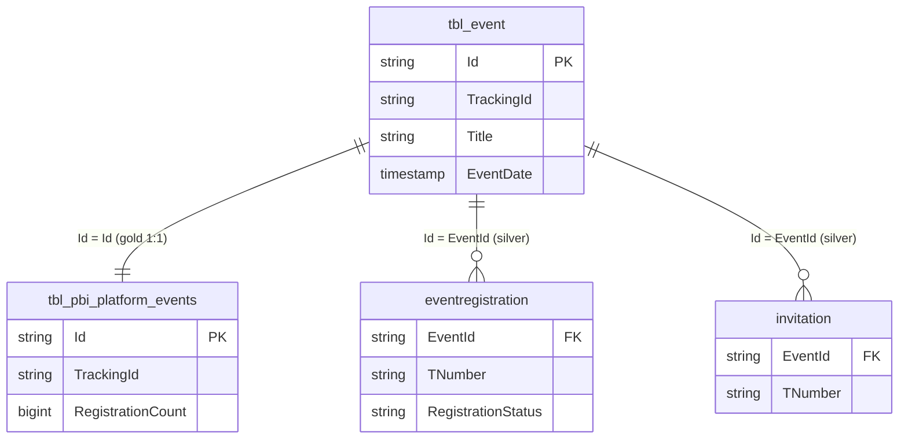

# `imep_bronze.tbl_event`

> **Event-Master-Tabelle** — Events als Feature in iMEP (nicht zu verwechseln mit "Email-Events" im Sinne von Opens/Clicks). Trägt **`TrackingId`** (eine der nur 4 Tabellen mit dieser Spalte). Für Event-Registrations siehe zusätzlich `imep_silver.eventregistration` (13.7M).

| | |
|---|---|
| **Layer** | Bronze |
| **Source system** | iMEP (SQL Server) → CDC → Delta |
| **Grain** | 1 row per Event-Definition |
| **Primary key** | `Id` |
| **Cross-channel key** | `TrackingId` |
| **Refresh** | 2×/Tag @ 00:00/12:00 UTC (MERGE) |
| **Approx row count** | ~100K (Q27, Timespan 2009 – Apr 2026 — ältester Datenbestand im Projekt!) |
| **PII** | gering — Event-Definitionen sind intern |

---

## Key Columns (erwartet — exakt Verifikation via `DESCRIBE`)

| Column | Type | Role | Notes |
|---|---|---|---|
| `Id` | string | **PK** | Event-GUID |
| `TrackingId` | string | **Cross-channel key** | Format wie `tbl_email.TrackingId`, 32-char 5-seg |
| `Title` | string | | Event-Name |
| `EventDate` | timestamp | | Wann das Event stattfindet |
| `CreatedBy` | string | | TNumber des Creators |
| `CreationDate` | timestamp | | Wann wurde das Event angelegt |

Vollständiges Schema: `DESCRIBE imep_bronze.tbl_event`.

---

## Beziehungen



---

## Primary joins

### → `imep_silver.eventregistration` — Wer hat registriert?

```sql
SELECT e.Title, e.EventDate, e.TrackingId, er.TNumber, er.RegistrationStatus
FROM   imep_bronze.tbl_event           e
JOIN   imep_silver.eventregistration   er ON er.EventId = e.Id
WHERE  e.TrackingId IS NOT NULL
  AND  e.EventDate >= '2025-01-01'
```

### → `imep_gold.tbl_pbi_platform_events` — Pre-aggregated mit Registration-Count

```sql
SELECT e.Title, e.TrackingId, pe.RegistrationCount
FROM   imep_bronze.tbl_event                 e
JOIN   imep_gold.tbl_pbi_platform_events     pe ON pe.Id = e.Id
```

→ Für Dashboard-Consumption: Gold nutzen statt Bronze → Silver-Aggregation.

---

## Quality caveats

- **`EventDate` kann 2124 (Sentinel für "open-ended") sein** — Q1b bestätigt. Bei Filter-Logik `WHERE EventDate < '2100-01-01'` absichern wenn gewollt.
- **Ältester Datenbestand im Projekt** (ab 2009). Vor 2020 kaum Relevanz für Cross-Channel-Analysen, aber historische Events existieren.
- **TrackingId-Adoption**: Die meisten pre-2024-Events haben kein TrackingId — Cross-Channel-Attribution nur für neuere Events möglich.

---

## Lineage

```
imep_bronze.tbl_event
        │
        ├──► imep_silver.event (84K), invitation, eventregistration (13.7M)  [Silver existiert für Events!]
        │
        └──► imep_gold.tbl_pbi_platform_events (84K) mit RegistrationCount
```

**Wichtig**: Events sind **der eine Bereich**, wo `imep_silver` existiert (Q26). Email-Engagement **nicht**.

---

## Referenzen

- `eventregistration.md` *(Silver-Card pending)*
- [tbl_email.md](tbl_email.md) — Parallele Struktur für Mailings
- [er_imep_bronze.md](../../diagrams/er_imep_bronze.md)
- [cross_channel_via_tracking_id.md](../../joins/cross_channel_via_tracking_id.md) — TrackingId-Match-Regel gilt auch für Events
