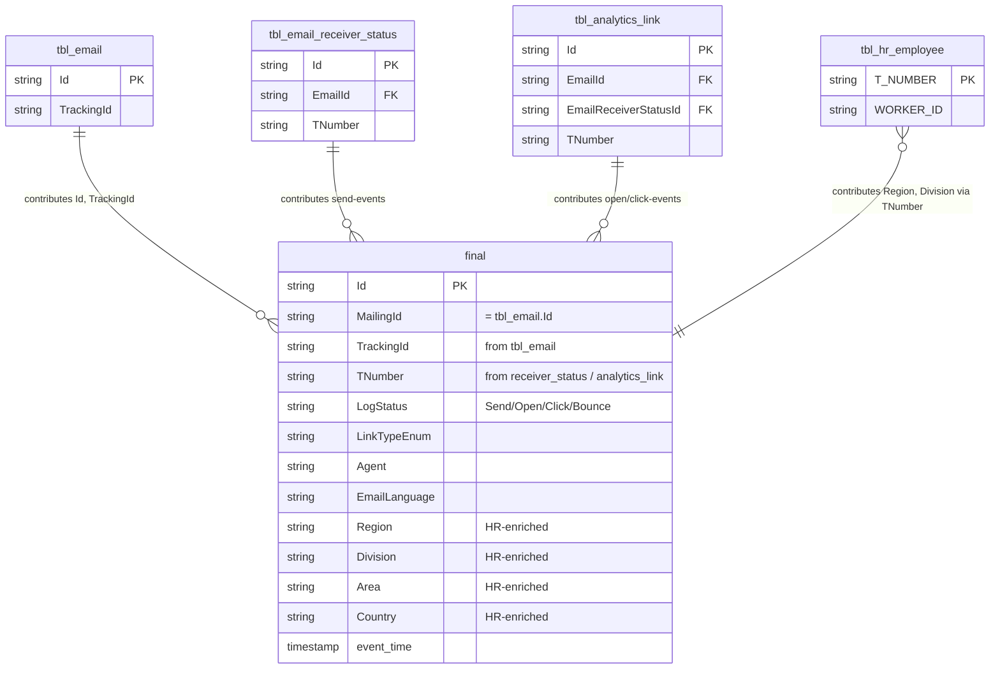

# `imep_gold.final`

> **Der denormalisierte Consumption-Endpoint für Email-Engagement.** 520M Rows, wird 2×/Tag via CTAS komplett neu aufgebaut. Kombiniert `tbl_email` + `tbl_email_receiver_status` + `tbl_analytics_link` mit HR-Enrichment (Region, Division, etc.) — in einer einzigen Tabelle. Email-Engagement hat **bewusst keine Silver-Schicht**; `final` **ist** der Silver-Skip-Endpoint. *(Q26)*

| | |
|---|---|
| **Layer** | Gold (Consumption) |
| **Source systems** | iMEP Bronze (3 Tabellen) + HR (Bronze) |
| **Grain** | 1 row per Empfänger-Event (Send / Open / Click / Bounce) mit vollem HR-Context |
| **Primary key** | `Id` (+ evtl. Composite — via Q30 zu klären) |
| **Cross-channel key** | `TrackingId` (via Join auf Mailing-Master inherited) |
| **Refresh** | **2×/Tag @ ~00:23 und ~12:25 UTC** (**CTAS Full Rebuild** — komplettes `CREATE OR REPLACE TABLE AS SELECT`, **keine Inkrementalität**, Service Principal) — Q28 |
| **Approx row count** | **~520M** (Q26/Q27/Q28-Stand 2026-04-20, Timespan Jun 2021 – Apr 2026) |
| **PII** | `TNumber`, evtl. `Receiver` → direkt identifizierend |
| **⚠️ Label-Verwirrung** | Image in Q28 labelte dieselbe Tabelle als `tbl_pbi_platform_mailings` — vermutlich Image-Fehler (Q27 hat `tbl_pbi_platform_mailings` bei 73K Rows). Verifizierung via Q30. |

---

## Neighborhood — Gold-Endpoint im Kontext



> **Hinweis**: Exakte Spaltenliste muss per `DESCRIBE imep_gold.final` verifiziert werden. Obige Schema-Annahme basiert auf Q26/Q27-Findings (HR-Enrichment spät, denormalisiert) und typischen Gold-Patterns.

---

## Key Columns (erwartet — Verifikation Q30 pending)

| Column | Type | Role | Notes |
|---|---|---|---|
| `Id` | string | **PK** | Event-ID |
| `MailingId` | string | FK-Äquivalent | = `tbl_email.Id` — wird durch CTAS denormalisiert |
| `TrackingId` | string | **Cross-channel key** | Inherited von `tbl_email` |
| `TNumber` | string | Person-Key | Lowercase `t######` |
| `LogStatus` / `LinkTypeEnum` | string | Event-Type | Kombiniert Send-Status + Open/Click-Type |
| `Region`, `Division`, `Area`, `Country` | string | HR-enriched | Via `tbl_hr_employee` + `tbl_hr_costcenter` zur Build-Zeit gejoined |
| `event_time` | timestamp | Temporal | Send-Zeit oder Event-Zeit — per `DESCRIBE` zu klären |

→ Vollständige Spaltenliste via `DESCRIBE imep_gold.final` in Databricks verifizieren (Q30-Follow-up).

---

## Sample row (strukturell)

```
Id           = "..."
MailingId    = "0a3f6c2e-..."      -- = tbl_email.Id
TrackingId   = "QRREP-0000058-240709-0000060-EMI"
TNumber      = "t100200"
LogStatus    = "Click"
Agent        = "Desktop Outlook"
Region       = "EMEA"
Division     = "Wealth Management"
Country      = "CH"
event_time   = 2024-07-09 09:34:12
```

---

## Primary joins

### Pattern A: Direkte Konsumption (default für Dashboards)

```sql
SELECT TrackingId, Region, Division, LogStatus, COUNT(*) AS events
FROM   imep_gold.final
WHERE  event_time >= '2025-01-01'
  AND  TrackingId IS NOT NULL
GROUP BY TrackingId, Region, Division, LogStatus
```

### Pattern B: Pack-Level-Aggregation (Dashboard-Grain)

```sql
SELECT array_join(slice(split(UPPER(TrackingId), '-'), 1, 2), '-') AS tracking_pack_id,
       COUNT(DISTINCT CASE WHEN LogStatus = 'Sent'  THEN TNumber END) AS sent_unique,
       COUNT(DISTINCT CASE WHEN LogStatus = 'Open'  THEN TNumber END) AS open_unique,
       COUNT(DISTINCT CASE WHEN LogStatus = 'Click' THEN TNumber END) AS click_unique
FROM   imep_gold.final
WHERE  TrackingId IS NOT NULL
  AND  event_time >= '2025-01-01'
GROUP BY 1
```

### Pattern C: Cross-Channel-Funnel (mit SharePoint)

Siehe [join_strategy_contract.md](../../joins/join_strategy_contract.md) Pattern C — `final` ist die Email-Seite des Funnels, gejoint gegen SharePoint via SEG1-4-Match.

---

## Quality caveats

- **⚠️ CTAS Full Rebuild 2×/Tag** — die Tabelle wird komplett zerstört und neu aufgebaut. Lange Queries über die Refresh-Fenster (`00:23` + `12:25` UTC) hinweg können auf inkonsistenten Stand treffen.
- **Keine Inkrementalität auf Gold-Seite** — jede Änderung in Bronze landet erst nach dem nächsten CTAS-Run in `final`. Bei Out-of-Band-Fragen nach neueren Events → Bronze-Tabellen direkt nutzen.
- **Full-Scan kostet**: 520M Rows × breites Schema. Queries **immer** mit `event_time`-Filter oder `TrackingId`-Filter einschränken. Die Gold-CTAS hat laut Q28 **kein Z-Order** — auf bestimmte Spalten optimierte Queries gibt es nicht.
- **HR-Snapshot zur Build-Zeit**: `Region`/`Division` reflektieren den HR-Stand zum CTAS-Zeitpunkt. Wechselt ein Mitarbeiter am 1. Juli von EMEA → APAC, zeigen alle älteren `final`-Events **nach dem nächsten CTAS** den neuen Wert — nicht den historischen. Für echte temporale HR-Analysen muss aus Bronze mit `tbl_hr_employee`-Snapshot gejoint werden.
- **Biggest compute hotspot im gesamten Pipeline-Budget** — CTAS-Rebuild einer 520M-Row-Tabelle 2×/Tag. Ist als erster Optimierungs-Lever identifiziert (Q28), aber nicht unsere Baustelle.

---

## Lineage

```
imep_bronze.tbl_email                   ┐
imep_bronze.tbl_email_receiver_status   ├──[CTAS 2×/Tag]──► imep_gold.final (520M)
imep_bronze.tbl_analytics_link          │
imep_bronze.tbl_hr_employee             │
imep_bronze.tbl_hr_costcenter           ┘
```

**Kein Silver dazwischen** — `imep_silver` existiert, aber nur für Events (`invitation`, `eventregistration`, `event`), **nicht für Email**.

---

## Consumption-Strategie

Für neue Cross-Channel-Analysen gilt:

- **Default**: `imep_gold.final` nutzen. Ist vorkonfektioniert, HR-ready.
- **Wenn du was in `final` nicht findest** (z.B. spezielle Bronze-Spalte): nicht `final` erweitern wollen, sondern direkt Bronze joinen.
- **Wenn `final` zu gross wird**: Tier-3-Aggregate nutzen (`tbl_pbi_mailings_region`, `_division`, `tbl_pbi_kpi`) — die sind per `GROUP BY MailingId × Dimension` vorverdichtet.

---

## Offene Verifikations-Items

1. **Name klären**: `imep_gold.final` vs. `tbl_pbi_platform_mailings` (Q28-Image-Inkonsistenz). Wahrscheinlich `final`. Via `SHOW TABLES IN imep_gold` validieren.
2. **Exaktes Schema**: `DESCRIBE imep_gold.final` — welche Spalten sind tatsächlich drin.
3. **Grain-Verifikation**: ist es wirklich 1 Row pro Event, oder 1 Row pro Mailing-Recipient (mit Status + letztem Event)?
4. **Spalten-Herkunft**: welche Spalten stammen aus welcher Bronze-Quelle? Für Lineage-Dokumentation relevant.

Q30 (`DESCRIBE EXTENDED`) klärt alle drei Punkte.

---

## Referenzen

- [Join Strategy Contract](../../joins/join_strategy_contract.md)
- [architecture_diagram.md](../../architecture_diagram.md)
- Memory: `imep_silver_q26_findings.md`, `imep_join_graph_q27_findings.md`, `imep_pipeline_ops_q28_findings.md`, `imep_gold_full_inventory.md`
