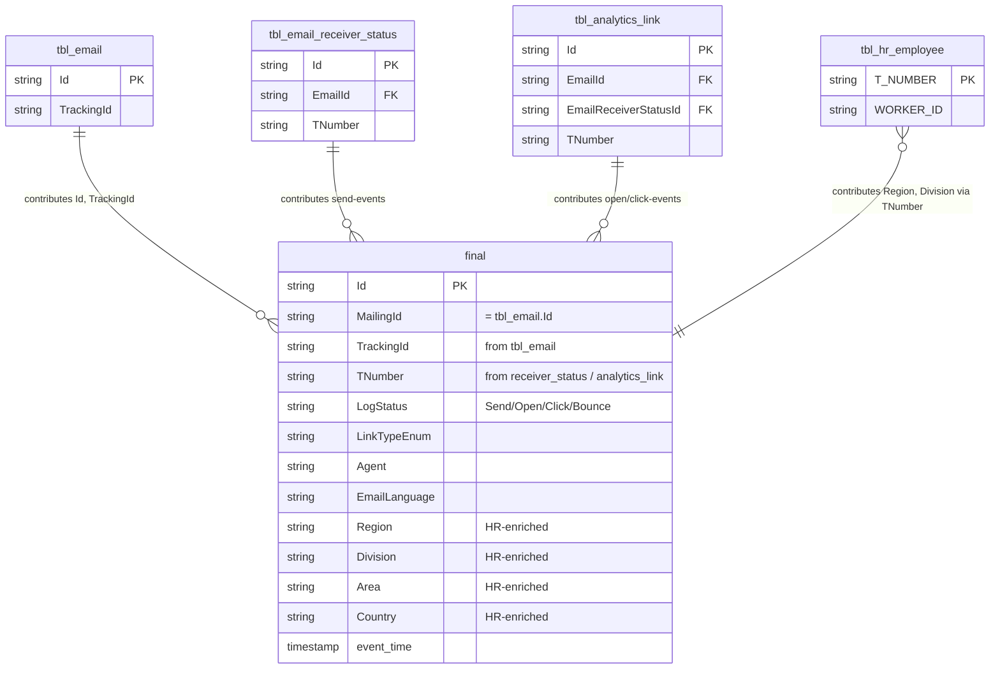

# `imep_gold.final`

> **The denormalized consumption endpoint for email engagement.** 520M rows, rebuilt completely via Full Rebuild (no incrementality). Combines `tbl_email` + `tbl_email_receiver_status` + `tbl_analytics_link` with HR enrichment (Region, Division, etc.) — in a single table. Email engagement has **deliberately no silver layer**; `final` **is** the silver-skip endpoint.

| | |
|---|---|
| **Layer** | Gold (consumption) — **Tier 0** (atomic fact) |
| **Source systems** | iMEP Bronze (3 tables) + HR (Bronze) |
| **Grain** | **1 row per `mailing × recipient × event × hour`** — events are hour-bucketed, not per individual event |
| **Primary key** | `Id` |
| **Cross-channel key** | `TrackingId` (inherited via join onto mailing master) |
| **Write pattern** | **Full Rebuild** — complete `CREATE OR REPLACE TABLE AS SELECT`, **no incrementality** (Service Principal) |
| **Approx row count** | **~520M**, 64,196 distinct mailings (as of 2026-04-20) |
| **Physical storage** | External Delta, ADLS path `abfss://gold@<gold-acc>/.../final`, **no partitioning** — full-scan risk on queries without a time filter |

---

## Neighborhood — gold endpoint in context



> **Note**: exact column list must be verified via `DESCRIBE imep_gold.final`. The schema assumption above is based on later Genie findings (late HR enrichment, denormalized) and typical gold patterns.

---

## Key Columns (expected — DESCRIBE verification pending)

| Column | Type | Role | Notes |
|---|---|---|---|
| `Id` | string | **PK** | Event ID |
| `MailingId` | string | FK equivalent | = `tbl_email.Id` — denormalized on Full Rebuild |
| `TrackingId` | string | **Cross-channel key** | Inherited from `tbl_email` |
| `TNumber` | string | Person key | Lowercase `t######` |
| `LogStatus` / `LinkTypeEnum` | string | Event type | Combines send status + open/click type |
| `Region`, `Division`, `Area`, `Country` | string | HR-enriched | Joined at build time via `tbl_hr_employee` + `tbl_hr_costcenter` |
| `event_time` | timestamp | Temporal | Send time or event time — to clarify via `DESCRIBE` |

-> Verify full column list in Databricks via `DESCRIBE imep_gold.final` (follow-up).

---

## Sample row (structural)

```
Id           = "..."
MailingId    = "0a3f6c2e-..."      -- = tbl_email.Id
TrackingId   = "QRREP-0000058-240709-0000060-EMI"
TNumber      = "t100200"
LogStatus    = "Click"
Agent        = "Desktop Outlook"
Region       = "EMEA"
Division     = "Wealth Management"
Country      = "CH"
event_time   = 2024-07-09 09:34:12
```

---

## Primary joins

### Pattern A: Direct consumption (default for dashboards)

```sql
SELECT TrackingId, Region, Division, LogStatus, COUNT(*) AS events
FROM   imep_gold.final
WHERE  event_time >= '2025-01-01'
  AND  TrackingId IS NOT NULL
GROUP BY TrackingId, Region, Division, LogStatus
```

### Pattern B: Pack-level aggregation (dashboard grain)

```sql
SELECT array_join(slice(split(UPPER(TrackingId), '-'), 1, 2), '-') AS tracking_pack_id,
       COUNT(DISTINCT CASE WHEN LogStatus = 'Sent'  THEN TNumber END) AS sent_unique,
       COUNT(DISTINCT CASE WHEN LogStatus = 'Open'  THEN TNumber END) AS open_unique,
       COUNT(DISTINCT CASE WHEN LogStatus = 'Click' THEN TNumber END) AS click_unique
FROM   imep_gold.final
WHERE  TrackingId IS NOT NULL
  AND  event_time >= '2025-01-01'
GROUP BY 1
```

### Pattern C: Cross-channel funnel (with SharePoint)

See [join_strategy_contract.md](../../joins/join_strategy_contract.md) Pattern C — `final` is the email side of the funnel, joined against SharePoint via SEG1-2 match.

---

## Quality caveats

- **⚠️ Full Rebuild** — the table is destroyed and rebuilt entirely, not merged incrementally. Long-running queries in parallel with a rebuild run may hit a temporarily inconsistent state. Refresh cadence not documented — we do not have a complete job-scheduler overview.
- **No incrementality on the gold side** — any bronze change only lands in `final` after the next rebuild run. For out-of-band questions about newer events -> use bronze tables directly.
- **Full scan is costly**: 520M rows × wide schema. **Always** constrain queries with an `event_time` or `TrackingId` filter. The Gold Full Rebuild has **no Z-Order** — there are no queries optimized on specific columns.
- **⚠️ No partitioning** — zero partitioning is the biggest structural performance gap in the whole system. Partitioning by date would drastically reduce scan I/O and rebuild cost, but that is an architecture change on the iMEP team, not on us.
- **HR snapshot at build time**: `Region`/`Division` reflect the HR state at the rebuild timestamp. If an employee moves on July 1 from EMEA -> APAC, all older `final` events show the new value **after the next Full Rebuild** — not the historical one. For true temporal HR analyses, join from bronze with a `tbl_hr_employee` snapshot.
- **Biggest compute hotspot in the entire pipeline budget** — full rebuild of a 520M-row table. Identified as the top optimization lever, but not our area.

---

## Lineage

```
imep_bronze.tbl_email                   +
imep_bronze.tbl_email_receiver_status   +--[Full Rebuild]--> imep_gold.final (520M)
imep_bronze.tbl_analytics_link          |
imep_bronze.tbl_hr_employee             |
imep_bronze.tbl_hr_costcenter           +
```

**No silver in between** — `imep_silver` exists, but only for events (`invitation`, `eventregistration`, `event`), **not for email**.

---

## Consumption strategy

For new cross-channel analyses the rule is:

- **Default**: use `imep_gold.final`. Pre-assembled, HR-ready.
- **If you can't find something in `final`** (e.g. a specific bronze column): don't extend `final` — join bronze directly.
- **If `final` gets too large**: use the Tier-3 aggregates (`tbl_pbi_mailings_region`, `_division`, `tbl_pbi_kpi`) — these are pre-rolled-up via `GROUP BY MailingId × Dimension`.

---

## Verification state after later verification ✅

| Item | State |
|---|---|
| Name | ✅ `imep_gold.final` (explicitly confirmed, earlier label confusion resolved) |
| Rows | ✅ 520M, 64,196 distinct mailings |
| Tier classification | ✅ Tier 0 (atomic fact) |
| Grain | ✅ `mailing × recipient × event × hour` (events are hour-bucketed) |
| Storage | ✅ External Delta, ADLS path `abfss://gold@<gold-acc>/.../final`, no partitioning |
| Source columns (which from which bronze) | ⚠️ check via `DESCRIBE imep_gold.final` in Databricks if needed |

---

## References

- [Join Strategy Contract](../../joins/join_strategy_contract.md)
- [architecture_diagram.md](../../architecture_diagram.md)
- Memory: `imep_silver_q26_findings.md`, `imep_join_graph_q27_findings.md`, `imep_pipeline_ops_q28_findings.md`, `imep_gold_full_inventory.md`

---

## Sources

Genie sessions backing the statements on this page: [Q26](../../sources.md#q26), [Q27](../../sources.md#q27), [Q28](../../sources.md#q28), [Q29](../../sources.md#q29), [Q30](../../sources.md#q30). See [sources.md](../../sources.md) for the full directory.
