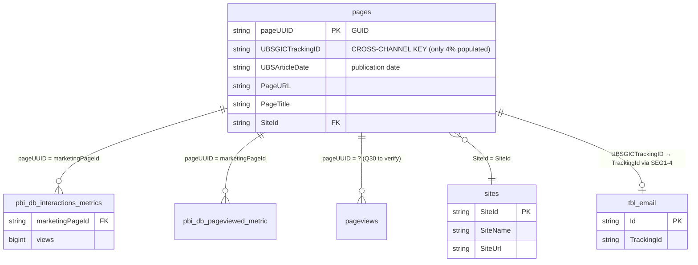

# `sharepoint_bronze.pages`

> **Die Cross-Channel-Brücke.** Page-Inventory mit `UBSGICTrackingID` — **der einzige Ort**, an dem SharePoint-Side-Interaktionen einem Pack zugeordnet werden können. 48K Rows, aber nur **1,949 (~4%) haben `UBSGICTrackingID` populated**. Das ist der kritischste Coverage-Blocker im gesamten Cross-Channel-Modell. *(Q22, Q25)*

| | |
|---|---|
| **Layer** | Bronze |
| **Source system** | SharePoint → (CDC / Snapshot) → Delta |
| **Grain** | 1 row per SharePoint-Page (Snapshot) |
| **Primary key** | `pageUUID` (GUID) |
| **Cross-channel key** | `UBSGICTrackingID` — **nur 4% populated** ⚠️ |
| **Refresh** | **1×/Tag @ ~02:00 UTC** (MERGE Daily Snapshot Replace, Service Principal) — Q28 |
| **Approx row count** | **~48K** (Q17/Q27-Stand, Timespan 1900 – Apr 2026) |
| **PII** | keine direkte PII — Pages selbst sind öffentlich im Intranet |
| **Coverage** | 1,949 / 48,419 Pages (~4%) haben TrackingID → **nur Article-Pages (News/Events)** |

---

## Neighborhood — Dimension-Table für Cross-Channel



---

## Key Columns

| Column | Type | Role | Notes |
|---|---|---|---|
| `pageUUID` | string (GUID) | **PK** | Eindeutig pro Page. Wird als `marketingPageId` in allen `sharepoint_gold.*`-Metric-Tables referenziert. |
| `UBSGICTrackingID` | string | **Cross-channel key** | Format: `CLUSTER-PACK-YYMMDD-ACTIVITY-CHANNEL` (32-char, 5-seg, UPPER). **Nur 4% populated.** |
| `UBSArticleDate` | date | Publication date | Wann wurde der Artikel publiziert. Bei non-Article-Pages oft NULL. |
| `PageURL` / `PageUrl` / `url` | string | URL | Spalten-Name variiert — verify via `DESCRIBE`. 1:1 URL↔TID-Mapping laut Q25. |
| `PageTitle` | string | Display | Page-Titel |
| `SiteId` | string | FK → `sites.SiteId` | Site-Zuordnung (99.4% der getrackten Pages = "News and events") |

Vollständige Liste (95 Spalten insgesamt laut Q17) via `DESCRIBE sharepoint_bronze.pages`.

---

## Sample row

```
pageUUID          = "f94bc186-32a2-4155-aaec-42b22091cd22"
UBSGICTrackingID  = "QRREP-0000058-240709-0000060-IAN"     -- note: SEG5 = IAN (SharePoint)
UBSArticleDate    = 2024-07-09
PageURL           = "/sites/news/articles/q2-investor-update.aspx"
PageTitle         = "Q2 Investor Update 2024"
SiteId            = "..."
```

---

## Primary joins

### → `pbi_db_interactions_metrics` (1:N) — Der Standard-Cross-Channel-Weg

```sql
SELECT p.UBSGICTrackingID, p.PageURL, p.UBSArticleDate,
       SUM(m.views)  AS total_views,
       SUM(m.visits) AS total_visits,
       COUNT(DISTINCT m.viewingcontactid) AS unique_viewers
FROM   sharepoint_bronze.pages p
JOIN   sharepoint_gold.pbi_db_interactions_metrics m ON m.marketingPageId = p.pageUUID
WHERE  p.UBSGICTrackingID IS NOT NULL            -- Pflicht-Filter für Attribution
  AND  m.visitdatekey   >= '20250101'            -- Default-Zeitraum ab 2025
GROUP BY p.UBSGICTrackingID, p.PageURL, p.UBSArticleDate
```

### → `sites` (N:1) — Site-Kontext

```sql
SELECT p.*, s.SiteName, s.SiteUrl
FROM   sharepoint_bronze.pages p
LEFT JOIN sharepoint_bronze.sites s ON s.SiteId = p.SiteId
```

### → iMEP Cross-Channel Link (SEG1-4)

```sql
-- Pack-Level-Link: tbl_email × pages via SEG1-4
WITH email_packs AS (
  SELECT DISTINCT
         array_join(slice(split(UPPER(TrackingId), '-'), 1, 4), '-') AS seg1_4,
         TrackingId AS email_tid
  FROM   imep_bronze.tbl_email
  WHERE  TrackingId IS NOT NULL
),
page_packs AS (
  SELECT DISTINCT
         array_join(slice(split(UPPER(UBSGICTrackingID), '-'), 1, 4), '-') AS seg1_4,
         UBSGICTrackingID AS page_tid
  FROM   sharepoint_bronze.pages
  WHERE  UBSGICTrackingID IS NOT NULL
)
SELECT e.email_tid, p.page_tid, e.seg1_4 AS common_activity
FROM   email_packs e
JOIN   page_packs  p ON p.seg1_4 = e.seg1_4
```

---

## Quality caveats — kritisch

### ⚠️ 4%-Coverage-Blocker (Q22)

Nur **1,949 / 48,419 Pages** haben `UBSGICTrackingID`. Konsequenz:

- Nur ~4% der 84M SharePoint-Interaction-Rows sind Pack-attribuierbar
- Die restlichen 96% = "untracked intranet activity" (interne Tools, Settings, Collab-Pages etc.)
- **Dashboard muss das explizit machen** — entweder (a) nur die 4%-Teilmenge zeigen und als "Article Pages only" labeln, oder (b) zwei getrennte Sektionen (attributed vs. unattributed)

### Site-Konzentration (Q25)

**99.4% der getrackten Pages** (1,937 von 1,949) liegen auf **einer einzigen Site**: "News and events".

- Dashboard-Default **sollte** auf diese Site restringiert sein
- Für "Coverage reality check": 83 Pack-IDs (SEG1-2) sind diesem Dashboard zugänglich

### Coverage-Rollout (Q25)

- **Start der TID-Populierung**: September 2024 (33.9% Coverage für neue Pages)
- **Peak bisher**: März 2026 (70.5%)
- **Nie 80% erreicht** — selbst "aktuelle" Pages haben 25-30% fehlende TIDs

→ Default-Zeitfilter: `UBSArticleDate >= '2024-09-01'`.

### Format-Inkonsistenzen

- `UBSGICTrackingID` sollte immer UPPER, clean, 32-char sein — aber beim Vergleich mit iMEP immer `UPPER(TRIM(...))` absichern
- SEG5 (Channel) divergiert: iMEP führt `EMI`/`NLI`/`TWE`, SharePoint `IAN`/`ITS`/`OPN`/`ANC` — **SEG5 ignorieren** beim Cross-Channel-Match (siehe Regel 3 in [join_strategy_contract.md](../../joins/join_strategy_contract.md))

### 1:1 URL ↔ TID

Q25 bestätigt: Jede URL hat maximal eine TID, jede TID maximal eine URL. D.h. **URL-basierte Aggregation** ist äquivalent zu TID-basierter — bei Bedarf URL als Fallback-Key nutzen.

---

## Lineage

```
SharePoint (CMS) ──[Daily Snapshot MERGE @ 02:00 UTC]──► sharepoint_bronze.pages
                                                                │
                                                                └──► sharepoint_silver.webpage (normalized dimension)
                                                                         │
                                                                         └──► pbi_db_* Gold-Metric-Tables referenzieren pageUUID
```

**Refresh-Anomalie**: Als Daily Snapshot Replace — die gesamte Tabelle wird einmal täglich überschrieben. `MERGE on (id: PageUId)` (Q28). Page-Deletions propagieren deshalb nach maximal 24h.

---

## Verwandte Cards

- [pbi_db_interactions_metrics](../sharepoint_gold/pbi_db_interactions_metrics.md) — Haupt-Consumer
- `sites.md` *(pending)* — Site-Dimension
- `pageviews.md` *(pending)* — Interaction-Bronze (ohne TrackingID-Attribution)
- `webpage.md` *(pending)* — Silver-Variante dieser Tabelle

---

## Referenzen

- [join_strategy_contract.md](../../joins/join_strategy_contract.md) — Coverage-Regeln (Regel 5)
- [architecture_diagram.md](../../architecture_diagram.md) — Section 4 (Cross-Channel-Join) und Section 7 (Coverage-Disclaimer)
- Memory: `sharepoint_gold_schemas_q22.md`, `sharepoint_pages_coverage_q25.md`, `sharepoint_pages_inventory.md`
