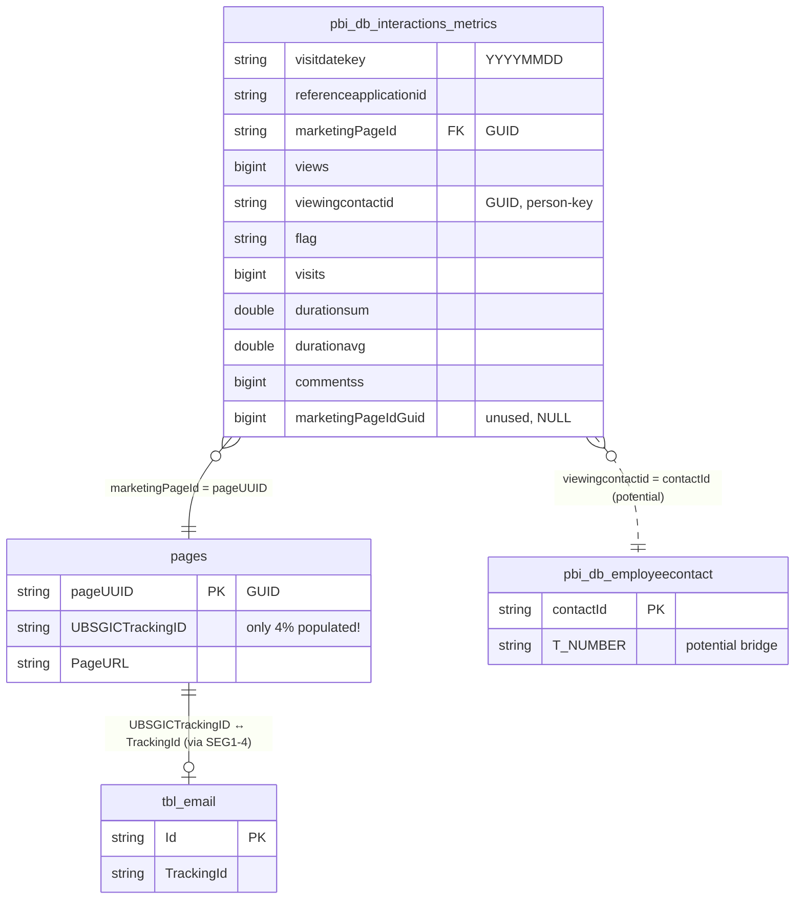

# `sharepoint_gold.pbi_db_interactions_metrics`

> **Master Interaction Fact für SharePoint.** 84M Rows, 11 Spalten. Zentrale Tabelle für PageView-, Visit-, Duration- und Comment-Metriken auf Page × Date × Contact-Grain. **Trägt keinen direkten TrackingID** — Cross-Channel-Attribution läuft immer über `marketingPageId → pageUUID → UBSGICTrackingID` via `sharepoint_bronze.pages`. *(Q22)*

| | |
|---|---|
| **Layer** | Gold (Consumption) |
| **Source system** | SharePoint Analytics (aggregiert aus `sharepoint_silver`) |
| **Grain** | 1 row per `marketingPageId × visitdatekey × viewingcontactid × referenceapplicationid` |
| **Primary key** | Composite (wahrscheinlich — via Q30 zu klären) |
| **Cross-channel key** | **keiner direkt** — nur über FK-Kette `marketingPageId → pageUUID → UBSGICTrackingID` |
| **Refresh** | Täglicher Gold-Build (exakte Cadence Q28-Follow-up) |
| **Approx row count** | **~84M** (Q22/Q17-Stand, Zeitrahmen ab 2023) |
| **PII** | `viewingcontactid` (GUID) → indirekt identifizierend |

---

## Neighborhood — FK-Kette zum Cross-Channel-Join



---

## Key Columns

| Column | Type | Sample | Role |
|---|---|---|---|
| `visitdatekey` | string | `20230421` | **Tages-Key** im Format `YYYYMMDD`. Grain-bestimmend. |
| `referenceapplicationid` | string | `2` | Applikations-Referenz (welches System) |
| `marketingPageId` | string (GUID) | `f94bc186-32a2-4155-aaec-42b22091cd22` | **FK** → `pages.pageUUID`. Der einzige Cross-Channel-Pfad. |
| `views` | bigint | `1` | PageView-Count |
| `viewingcontactid` | string (GUID) | `1254e21a-0b2b…` | **Person-Key** — nicht TNumber, aber Bridge via `pbi_db_employeecontact` möglich |
| `flag` | string | `1` | Bedeutung unklar — Q30-Follow-up |
| `visits` | bigint | `1` | Distinct Visit-Count (mit Dedup) |
| `durationsum` | double | `7.72` | Aufenthaltszeit (Sekunden, summiert) |
| `durationavg` | double | `7.72` | Durchschnittliche Duration |
| `commentss` | bigint | `0` | Kommentar-Count (tippfehler in Spaltenname — **`commentss`** mit doppeltem s) |
| `marketingPageIdGuid` | bigint | `NULL` | Always NULL — vermutlich Legacy-Spalte |

CDM-Validation hat das Mapping bestätigt: `sourceName: mailync_marketingpageid`, `dataFormat: Guid`.

---

## Primary joins

### → `sharepoint_bronze.pages` (N:1) — der Standard-Lookup

```sql
SELECT m.*, p.UBSGICTrackingID, p.PageURL, p.SiteName
FROM   sharepoint_gold.pbi_db_interactions_metrics m
LEFT JOIN sharepoint_bronze.pages p ON p.pageUUID = m.marketingPageId
```

→ **LEFT JOIN**, sonst verlierst du die ~96% der Rows ohne gesetztes TrackingID.

### → Pack-Level-Cross-Channel-Funnel

```sql
SELECT array_join(slice(split(UPPER(p.UBSGICTrackingID), '-'), 1, 2), '-') AS tracking_pack_id,
       SUM(m.views)                  AS total_views,
       COUNT(DISTINCT m.viewingcontactid) AS unique_viewers,
       SUM(m.durationsum)            AS total_duration_sec
FROM   sharepoint_gold.pbi_db_interactions_metrics m
JOIN   sharepoint_bronze.pages p ON p.pageUUID = m.marketingPageId
WHERE  p.UBSGICTrackingID IS NOT NULL          -- Pflicht-Filter
  AND  m.visitdatekey >= '20250101'            -- Default-Zeitraum ab 2025
GROUP BY 1
```

### → Potentielle SharePoint-Person-Bridge

```sql
-- UNVERIFIED — Q17/Q22 hypothesize this works, not yet tested
SELECT m.*, ec.T_NUMBER
FROM   sharepoint_gold.pbi_db_interactions_metrics m
LEFT JOIN sharepoint_gold.pbi_db_employeecontact ec ON ec.contactId = m.viewingcontactid
```

→ Wenn das funktioniert, hätten wir einen TNumber für SharePoint-Views. **Noch nicht validiert.**

---

## Quality caveats

- **⚠️ Keine direkte TrackingID** — wenn jemand direkt `WHERE ...TrackingId = ...` sucht, findet er's nicht. Immer über `pages.UBSGICTrackingID` gehen.
- **4%-Coverage-Blocker** (kritisch!): Nur 1,949/48,419 Pages haben `UBSGICTrackingID`. Heisst: Von 84M Interaction-Rows sind **nur ~3.3M Pack-attribuierbar** (4%). Die restlichen 96% sind "untracked intranet activity". Dashboard **muss** diese Sektion explizit labeln.
- **`viewingcontactid` ≠ TNumber** — SharePoint-native Person-ID (GUID). Wenn Person-Level-Attribution nötig ist, läuft das über `pbi_db_employeecontact` (noch zu validieren).
- **Spalten-Typo**: `commentss` (mit doppeltem s). Nicht korrigieren, sonst bricht jeder Query.
- **`marketingPageIdGuid`** ist always NULL — ignorieren.
- **Grain-Anomalie**: Eine Page × Datum × Contact kann theoretisch mehrere Rows haben (durch `referenceapplicationid`-Variationen) — für Page-Date-Grain-Rollup `GROUP BY marketingPageId, visitdatekey` und `SUM(views)` nutzen.
- **`visitdatekey` als String formatiert** — für Zeit-Range-Filter Parse: `CAST(visitdatekey AS date)` oder String-Compare `visitdatekey >= '20250101'`.

---

## Lineage

```
sharepoint_bronze.customevents       ┐
sharepoint_bronze.pageviews          ├──► sharepoint_silver.webpagevisited  ──► sharepoint_gold.pbi_db_interactions_metrics
sharepoint_bronze.pagevisited_*      ┘                                              (Metric-Aggregation pro page × date × contact)
```

→ Im Unterschied zu iMEP-Email **läuft** hier Silver dazwischen (Q26 bestätigt). SharePoint nutzt das volle Medallion-Pattern.

---

## Schwestertabellen im selben Schema

Für **verschiedene Grain-Requirements** gibt es spezialisiertere Gold-Tables:

| Tabelle | Rows | Cols | Wann nutzen |
|---|---|---|---|
| **`pbi_db_interactions_metrics`** | 84M | 11 | Default — alles in einer Tabelle |
| `pbi_db_pageviewed_metric` | 84M | 5 | Nur View-Counts, fast aggregation |
| `pbi_db_pagevisited_metric` | 81M | 9 | Visit-orientiert (mit Dedup) |
| `pbi_db_datewise_overview_fact_tbl` | 7.5M | 31 | Pre-aggregated page × date × division mit Rolling Windows (7/14/21/28d) |
| `pbi_db_90_days_interactions_metric` | 9M | 11 | 90-Tage-Window, kleiner, schneller |

Faustregel: Für Ad-hoc-Abfragen `interactions_metrics`; für Dashboards mit Zeit-Rollups `datewise_overview_fact_tbl`; für reine Count-Queries `pageviewed_metric`.

---

## Referenzen

- [pages.md](../sharepoint/pages.md) — der Dimension-Lookup für TrackingID
- [join_strategy_contract.md](../../joins/join_strategy_contract.md) — Regeln für Cross-Channel-Join
- Memory: `sharepoint_gold_inventory.md`, `sharepoint_gold_schemas_q22.md`
